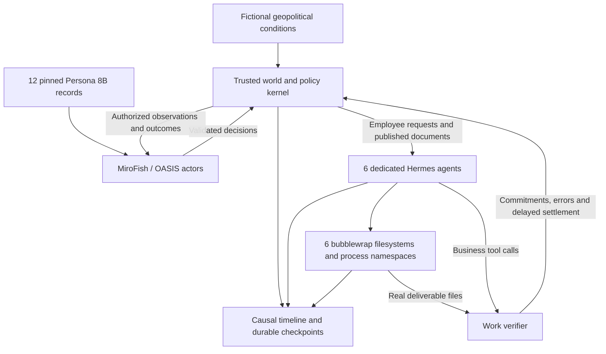

# Big World CL

**Persistent synthetic workplaces for studying continual adaptation through consequential work.** Enterprises, a government agency, consumers, employees and their AI assistants share a timeline. Changes in competition, policy and geopolitics alter business objectives and procedures; work outcomes influence subsequent decisions.

The current proof of concept uses actual **MiroFish/OASIS actors**, **12 distinct Persona 8B records**, and **one native Hermes agent with a persistent bubblewrap computer per employee**. It goes beyond independent episodes: files, obligations, organizational decisions, conversations and delayed consequences survive across sessions.

[PoC dataset on Hugging Face](https://huggingface.co/datasets/ojus1/BigWorld-PoC) · [Formal model and generation algorithm](lifespan/docs/ECOSYSTEM_DESIGN.md) · [Research framing](lifespan/docs/RESEARCH_DESIGN.md) · [Run instructions](docs/SETUP.md)

## What the PoC demonstrates

| Accepted run | Result |
|---|---:|
| Simulated days | 16 |
| Enterprises / agencies / consumers | 2 / 1 / 3 |
| Employees and separate Hermes computers | 6 |
| Imported synthetic Persona 8B records | 12 |
| Institutional and consumer decisions | 30 |
| Reconciled Hermes sessions / native model calls | 14 / 132 |
| Causal timeline events | 163 |
| Completed / pending work items at horizon | 10 / 0 |
| Verified unchanged files across workdays | 18 |
| Simulation business utility | 108.23 |

Four reconciled sessions left work pending before later retries. One additional infrastructure-interrupted attempt is archived separately; its partial costs are outside the reconciled utility total. Utility is a synthetic business score, not API spend.

On day 4 a fictional corridor disruption causes an agency to impose temporary review and firms to revise strategy. A consumer switches to a newly domestic offer. An existing employee's Hermes instance subsequently updates actual files to use a new endpoint, redaction and jurisdiction review while retaining peer review. The temporary rule expires on day 9. Following reopening on day 11, competition changes pricing and priorities again. The dataset's [walkthrough](https://huggingface.co/datasets/ojus1/BigWorld-PoC/blob/main/runs/ecosystem-bwrap/WALKTHROUGH.md) links decisions to recorded sessions and files.

This is an integration PoC, **not a controlled benchmark or a trained lifelong agent**. Early adapter revisions occurred during the run. Institutional realism, persona influence and advantages over memory baselines remain untested. No RL training or weight updates were performed.

## Architecture



MiroFish generates institutional, consumer and employee decisions. Hermes executes delegated work with native file, terminal, memory and skill tools. The kernel owns authority, effective dates, commitments and reward accounting. An assistant cannot redefine its success criteria by changing its own memory.

Bubblewrap uses Linux namespaces and the host kernel; it is not a VM. Only each employee's assigned files and home are writable inside its sandbox. The model transport stays outside so API credentials do not enter employee shell environments. Files persist across restarts; process state and `/tmp` do not.

## Quick start

See [setup](docs/SETUP.md) for pinned dependencies, MiroFish patches, Hermes installation and private API configuration. Live runs require model access and incur inference costs.

```bash
python3 scripts/stack.py start
MiroFish/backend/.venv/bin/python -u -m lifespan ecosystem \
  --out lifespan/artifacts/my-run --days 16
python3 -m lifespan.validate_ecosystem lifespan/artifacts/my-run
```

Use `--max-sessions 2` for a bounded pilot. Resume with the same output path without the cap. An unresolved `inflight.json` blocks automatic replay after an interrupted work session; reconcile that attempt before resuming.

Offline checks:

```bash
python3 -m unittest discover -s lifespan/tests -v
python3 scripts/verify.py
```

The archived `demo` command uses deterministic controllers and is a reference fixture. The current `ecosystem` command is the MiroFish/Persona/Hermes integration.

## Code and data

| Location | Purpose |
|---|---|
| `lifespan/ecosystem.py` | Entities, objectives, policy, consumers and event queues |
| `lifespan/ecosystem_run.py` | Native actors, employee sessions and recovery |
| `lifespan/computers.py`, `hermes_worker.py` | Dedicated Hermes workers and verified filesystem artifacts |
| `lifespan/bubblewrap.py`, `bwrap_server.py` | Native Hermes environment adapter and persistent sandbox supervisor |
| `lifespan/mirofish.py`, `personas.py` | Native MiroFish profiles/interviews and pinned Persona import |
| `lifespan/environment.py`, `world.py` | Trusted work tools, rules and utility |
| `lifespan/validate_ecosystem.py` | Offline causal, trajectory, file and reward audit |
| `patches/`, `local-overrides/` | Reproducible MiroFish compatibility and local graph changes |
| `scripts/export_dataset.py`, `scan_release.py` | Allowlisted public export and credential checks |

Raw runs, persona caches, credentials, native profiles and runtime logs are ignored by Git. The Hugging Face export separates authorized learner traces from privileged evaluator state, includes normalized content-addressed filesystem versions, and records omitted metadata and changed hashes. See [publication and data contract](docs/PUBLICATION.md).

For future RL experiments, optimize delayed task and business outcomes while accounting for errors, stale procedures, human help and compute. Evaluate held-out change mechanisms and compare memory/state/weight adaptation with matched information and budgets. Reacting institutions must be re-simulated for each learner; another learner's downstream customer behavior is not a fixed external input.

## Upstream projects and terms

- [MiroFish](https://github.com/666ghj/MiroFish), pinned at `39d849138ef254f6c737ab4c4705e5545dbe31d4`; patched source is distributed under AGPL-3.0.
- [MatrAIx Persona 1M / Persona 8B](https://huggingface.co/datasets/MatrAIx2026/MatrAIx_Persona_1M), pinned at `8b1073ab23d0c0ba0928386a041bac55e5365ddc`. The public release has 999,847 records; this PoC imports 12 synthetic records from one shard. [Paper](https://arxiv.org/abs/2608.04205).
- [Hermes Agent](https://github.com/NousResearch/hermes-agent), pinned at `2c8a2b65aa148ceb178d2251c54a523af12092c9`; upstream MIT license.
- [Bubblewrap](https://github.com/containers/bubblewrap), tested with 0.9.0.

Code in this repository is licensed under [AGPL-3.0](LICENSE), with upstream notices retained. **Persona-derived data has separate non-commercial research-only terms**, including subsets and derivatives; the code license does not relicense it. See [third-party notices](THIRD_PARTY_NOTICES.md) and [dataset terms](docs/DATASET_TERMS.md).
