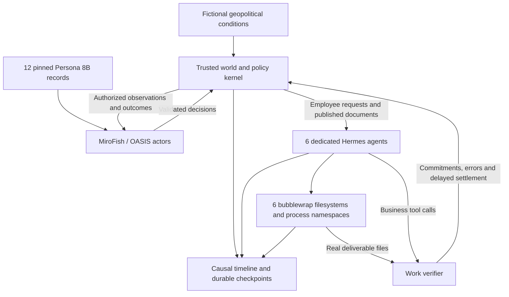

# Big World CL

**Persistent synthetic workplaces for studying continual adaptation through consequential work.** Enterprises, a government agency, consumers, employees and their AI assistants share a timeline. Changes in competition, policy and geopolitics alter business objectives and procedures; work outcomes influence subsequent decisions.

The historical proof of concept uses actual **MiroFish/OASIS actors**, **12 distinct Persona 8B records**, and **one native Hermes agent with a persistent bubblewrap computer per employee**. It goes beyond independent episodes: files, obligations, organizational decisions, conversations and delayed consequences survive across sessions.

The repository now also provides a **controlled deployment-time skill-learning evaluator** comparing no-learning Hermes with pinned upstream SkillOpt-Sleep. It adds substantive work rubrics, isolated candidate replays, chronological feedback, skill versions, compute accounting and paired world-level reports. This implementation is ready for new evaluations; the historical PoC is not evidence of a SkillOpt improvement.

[Run learning evaluations](docs/RUN_EVALUATION.md) · [Learning study](docs/LEARNING_STUDY_RESULTS.md) · [Audited native pilot](docs/EVALUATION_RESULTS.md) · [SkillOpt baseline](docs/SKILLOPT_BASELINE.md) · [PoC dataset on Hugging Face](https://huggingface.co/datasets/ojus1/BigWorld-PoC) · [Formal model](lifespan/docs/ECOSYSTEM_DESIGN.md) · [Runtime setup](docs/SETUP.md)

The current scaling work is running a [fresh six-world comparison](docs/SCALE_V3_002_LAUNCH.md) in three paired
waves, with four enterprises and twelve employee agents per world. All nine
slots in the [native startup qualification](docs/HERMES_STARTUP_SCOPE_V3_OUTCOME.md)
passed, including concurrent starts and cleanup. The new
[execution design](docs/SCALE_V3_RESOURCE_DESIGN.md) bounds the complete campaign
inside one resource scope and requires all six worlds for its primary endpoint.
The first v3 launch stopped before employee sessions because two MiroFish
overlay files were missing. The installation is repaired and its actual
capability endpoint now passes; that failed registration remains preserved.
The [dated startup observation](docs/SCALE_V3_002_PROGRESS.md) records native actor
simulations and returned employee sessions in both first-pair worlds. Use the
[read-only progress command](docs/SCALE_STATUS.md) for current local status.
Startup qualification is complete; the larger learning comparison is not yet
complete, and no learning gain is claimed.

## Evaluate deployment-time learning

The new evaluator uses native MiroFish/Persona actors and Hermes/bubblewrap execution. Each work attempt starts with fresh private agent state and an installed native `work-process` skill. No learning retains the seed skill; SkillOpt proposes revisions from available employee experience and adopts them only after separate validation and fresh final replay. Substantive tasks cover account reconciliation, renewal calculation and incident repair under changing requirements.

```bash
python3 scripts/install_skillopt.py
MiroFish/backend/.venv/bin/python -u -m lifespan.evaluation.runner \
  --config configs/evaluation/pilot_no_learning.json \
  --out lifespan/artifacts/evaluation/pilot-no-learning --stop-after-sessions 2
```

Complete [runtime setup](docs/SETUP.md) and start the local stack first. Follow the [evaluation guide](docs/RUN_EVALUATION.md) for the matching SkillOpt arm, clean resume, eight-day integration pilot, 24-day development configs, rubrics and paired reports. The pilot is one world pair and does not support strong aggregate claims. Skill-load omission and declared compute exhaustion remain measured outcomes; model/provider failures and incomplete accounting are reported separately.

The first completed native pilot contains **90 prospective work attempts and six
SkillOpt validation/training replays**. All sessions loaded the intended native
skill and passed the infrastructure/accounting audit. Neither consolidation cycle
adopted an edit because its training replay passed; this verifies integration,
but demonstrates no learning gain. The [results and reporting correction](docs/EVALUATION_RESULTS.md)
retain failed work and orders that arrived after the action horizon.

The [preregistered calibration](docs/CALIBRATION_PLAN.md) completed 44 fresh
native replays: 31 succeeded, and three of 22 repeated capsules had different
strict outcomes. Optional `skillopt_rollouts_k` enables pinned upstream
contrastive training replays; its validation gate remains single-shot. Matching
24-day configurations are provided in `configs/evaluation/dev_contrastive_*.json`.
The same plan includes a bounded employee-level experiment: one native SkillOpt
epoch over four previously observed obligations, then four frozen fresh tasks
under changed and reversed requirements. Both skill arms receive two attempts
per task. A separate auditor verifies the learning receipts, exact skill versions,
future-task isolation and every probe; no adoption produces an identical-skill
control. These are development transfer diagnostics, not independent world
replications or a final algorithm ranking.
The first such epoch proposed four edits and rejected them after a validation
regression; its deployed skill remained unchanged. See the
[learning study](docs/LEARNING_STUDY_RESULTS.md) for native evidence, compute,
fresh-task controls and remaining research limits.

The [larger study plan](docs/SCALE_STUDY_PLAN.md) expands to three paired seeds,
four enterprises and twelve employees per world, and twenty action days. It
plans up to 1,440 online native sessions, repeated SkillOpt epochs for every
employee with sufficient released experience, and future work after learning
from reversal feedback. Population configuration, per-epoch limits, actor request
ledgers, a concurrent world supervisor and independent campaign audits support
this next study. Planned scale is not a completed result. The
[execution observations](docs/SCALE_EXECUTION_NOTES.md) retain actor-output and
work-stream accounting interruptions and explain why those worlds cannot be
resumed as the same native state. A later host reboot interrupted the original
campaign, and the six-world v2 follow-up failed during employee startup; the
[v2 failure evidence](docs/SCALE_V2_STARTUP_FAILURES.md) retains every slot.

The scale study's [first accepted employee update](docs/SCALE_ADOPTION_INTERRUPTION.md)
passed the pinned gate on day 11. A later replay in that world lost a usage
receipt and stopped execution before any future work used the new skill.
Adoption therefore has zero prospective exposures and establishes no learning
gain. The [full follow-up plan](docs/SCALE_FOLLOWUP_PLAN.md) preserves all three
pairs in six fresh worlds with reviewed transport and accounting fixes.

## What the PoC demonstrates

| Accepted run | Result |
|---|---:|
| Simulated days | 16 |
| Enterprises / agencies / consumers | 2 / 1 / 3 |
| Employees and separate Hermes computers | 6 |
| Imported synthetic Persona 8B records | 12 |
| Institutional and consumer decisions | 30 |
| Reconciled Hermes sessions / native model calls | 14 / 132 |
| Causal timeline events | 163 |
| Completed / pending work items at horizon | 10 / 0 |
| Verified unchanged files across workdays | 18 |
| Simulation business utility | 108.23 |

Four reconciled sessions left work pending before later retries. One additional infrastructure-interrupted attempt is archived separately; its partial costs are outside the reconciled utility total. Utility is a synthetic business score, not API spend.

On day 4 a fictional corridor disruption causes an agency to impose temporary review and firms to revise strategy. A consumer switches to a newly domestic offer. An existing employee's Hermes instance subsequently updates actual files to use a new endpoint, redaction and jurisdiction review while retaining peer review. The temporary rule expires on day 9. Following reopening on day 11, competition changes pricing and priorities again. The dataset's [walkthrough](https://huggingface.co/datasets/ojus1/BigWorld-PoC/blob/main/runs/ecosystem-bwrap/WALKTHROUGH.md) links decisions to recorded sessions and files.

This is an integration PoC, **not a controlled benchmark or a trained lifelong agent**. Early adapter revisions occurred during the run. Institutional realism, persona influence and advantages over memory baselines remain untested. No RL training or weight updates were performed.

## Architecture



In the historical PoC, MiroFish generates institutional, consumer and employee decisions, and Hermes executes delegated work with native file, terminal, memory and skill tools. The controlled evaluator retains the reactive world while restricting private agent state to its declared comparison contract. The kernel owns authority, effective dates, commitments and reward accounting. An assistant cannot redefine its success criteria by changing its own memory.

Bubblewrap uses Linux namespaces and the host kernel; it is not a VM. Only each employee's assigned files and home are writable inside its sandbox. The model transport stays outside so API credentials do not enter employee shell environments. Files persist across restarts; process state and `/tmp` do not.

## Historical PoC quick start

See [setup](docs/SETUP.md) for pinned dependencies, MiroFish patches, Hermes installation and private API configuration. Live runs require model access and incur inference costs.

```bash
python3 scripts/stack.py start
MiroFish/backend/.venv/bin/python -u -m lifespan ecosystem \
  --out lifespan/artifacts/my-run --days 16
python3 -m lifespan.validate_ecosystem lifespan/artifacts/my-run
```

Use `--max-sessions 2` for a bounded pilot. Resume with the same output path without the cap. An unresolved `inflight.json` blocks automatic replay after an interrupted work session; reconcile that attempt before resuming.

Offline checks:

```bash
python3 -m unittest discover -s lifespan/tests -v
python3 scripts/verify.py
```

The archived `demo` command uses deterministic controllers and is a reference fixture. The current `ecosystem` command is the MiroFish/Persona/Hermes integration.

## Code and data

| Location | Purpose |
|---|---|
| `lifespan/ecosystem.py` | Entities, objectives, policy, consumers and event queues |
| `lifespan/ecosystem_run.py` | Native actors, employee sessions and recovery |
| `lifespan/computers.py`, `hermes_worker.py` | Dedicated Hermes workers and verified filesystem artifacts |
| `lifespan/bubblewrap.py`, `bwrap_server.py` | Native Hermes environment adapter and persistent sandbox supervisor |
| `lifespan/mirofish.py`, `personas.py` | Native MiroFish profiles/interviews and pinned Persona import |
| `lifespan/environment.py`, `world.py` | Trusted work tools, rules and utility |
| `lifespan/validate_ecosystem.py` | Offline causal, trajectory, file and reward audit |
| `lifespan/evaluation/` | Native learning comparison, semantic rubrics, SkillOpt bridge, transport budgets and paired metrics |
| `configs/evaluation/` | Matching no-learning/SkillOpt integration-pilot and development configs |
| `patches/`, `local-overrides/` | Reproducible MiroFish compatibility and local graph changes |
| `scripts/export_dataset.py`, `scan_release.py` | Allowlisted public export and credential checks |

Raw runs, persona caches, credentials, native profiles and runtime logs are ignored by Git. The Hugging Face export separates authorized learner traces from privileged evaluator state, includes normalized content-addressed filesystem versions, and records omitted metadata and changed hashes. See [publication and data contract](docs/PUBLICATION.md).

For future RL experiments, optimize delayed task and business outcomes while accounting for errors, stale procedures, human help and compute. Evaluate held-out change mechanisms and compare memory/state/weight adaptation with matched information and budgets. Reacting institutions must be re-simulated for each learner; another learner's downstream customer behavior is not a fixed external input.

## Upstream projects and terms

- [MiroFish](https://github.com/666ghj/MiroFish), pinned at `39d849138ef254f6c737ab4c4705e5545dbe31d4`; patched source is distributed under AGPL-3.0.
- [MatrAIx Persona 1M / Persona 8B](https://huggingface.co/datasets/MatrAIx2026/MatrAIx_Persona_1M), pinned at `8b1073ab23d0c0ba0928386a041bac55e5365ddc`. The public release has 999,847 records; this PoC imports 12 synthetic records from one shard. [Paper](https://arxiv.org/abs/2608.04205).
- [Hermes Agent](https://github.com/NousResearch/hermes-agent), pinned at `2c8a2b65aa148ceb178d2251c54a523af12092c9`; upstream MIT license.
- [SkillOpt](https://github.com/microsoft/SkillOpt), pinned at `79124b37e9a6371e13b753f8bcd7adb1e493ade1`; upstream MIT license. The evaluator uses its SkillOpt-Sleep consolidation with a documented public-trajectory context adapter.
- [Bubblewrap](https://github.com/containers/bubblewrap), tested with 0.9.0.

Code in this repository is licensed under [AGPL-3.0](LICENSE), with upstream notices retained. **Persona-derived data has separate non-commercial research-only terms**, including subsets and derivatives; the code license does not relicense it. See [third-party notices](THIRD_PARTY_NOTICES.md) and [dataset terms](docs/DATASET_TERMS.md).
