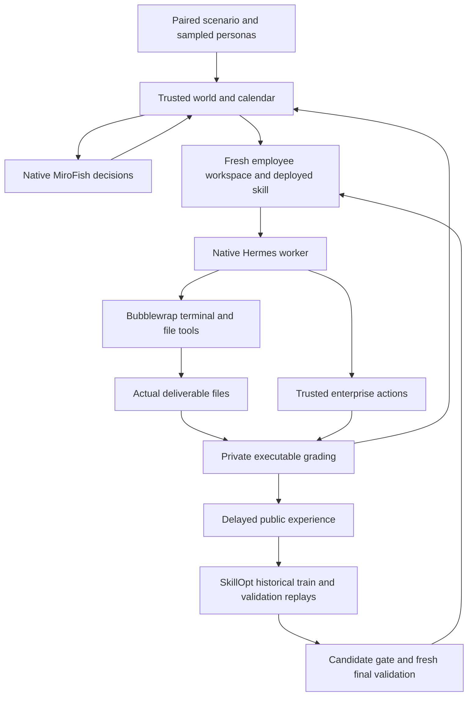

# Big-World-CL: codebase review and H200 adaptation

The repository implements a small persistent business world around native
MiroFish actors and Hermes computer use. Its continual-learning comparison
changes an employee's procedural skill document through upstream SkillOpt-Sleep.
It does not update model weights. The current controlled evaluator grades three
constructed JSON workflows; the newly sourced JobBench/EuroBench bank is a
separate, richer task source for the final world.

## Reviewed source and selected port

The upstream default branch was `20ba9ba`. The newest coworker branch was
`codex/qwen-scale` at `56bca012396cdcf7c86b71b72bb205ea1cb6a4ea`.
Our `codex/h200-flash-next` branch starts from main and selectively imports
67 runtime, native qualification, auditor and test files from that snapshot.
`H200_PORT.json` records their exact original hashes. It excludes the coworker's
scale-v2/v3 supervisors, historical registration documents, private prerequisite
requirements and dedicated startup-scope machinery.

The useful imported changes are nonstreaming Responses, explicit provider
binding, physical request accounting, terminal provider-failure propagation,
native actor JSON contracts, bounded bootstrap calls, leading-system-message
normalization, generation-schema compatibility, immutable native evidence,
canonical Python module entrypoints and updated learning audits. Optional
startup-observation definitions remain as runtime dependencies, disabled in our
pilot. Initial exploratory edits on main remain in Git stashes and were not
applied over the coworker's implementation.

Two additional issues surfaced on this host:

* The worker's sanitized environment discarded `HERMES_AGENT_ROOT`, although
  its interpreter and PYTHONPATH used the custom installation. Nonstreaming
  verification then looked in the default directory. The parent now explicitly
  passes its resolved installation path, while still excluding personal tools,
  profiles and credentials. A fresh-child-process regression covers this case.
* The first pilot exposed globally addressed incoming colleague mail alongside
  locally addressed allowed recipients. An actor replied using the incoming
  global sender and failed validation twice. Employee observations now project
  sender/recipient IDs into the existing local namespace, reject cross-firm
  mail and leave the stored routing records unchanged. The validator and its
  one-repair allowance are retained.

MiroFish's pinned configuration loads `.env` with `override=True`. Host/port and
the optional provider-profile selector therefore stay in the launching service's
environment, outside `.env`. This also keeps live profile selection out of legacy
offline test fixtures. No upstream MiroFish or Hermes revision was upgraded.

## Architecture and execution

| Area | Main source | What it owns |
|---|---|---|
| World kernel | `lifespan/world.py`, `environment.py` | Tasks, effective procedures, authority, approval, endpoints and business consequences |
| Economy | `lifespan/ecosystem.py` | Firms, consumers, government, competition, order queues, delayed settlement and shocks |
| Native actors | `lifespan/mirofish.py`, `ecosystem_run.py`, `actor_contract.py` | Persona compilation, OASIS state, interviews, bounded repairs, schema/receipt verification |
| Controlled experiment | `lifespan/evaluation/runner.py`, `protocol.py` | Calendar, eligibility, checkpoints, work dispatch, treatment and learning budgets |
| Employee execution | `computers.py`, `hermes_worker.py`, `bubblewrap.py`, `bwrap_server.py` | Native agent processes, files, isolated tools and enterprise-action RPC |
| Work generation/grading | `lifespan/evaluation/tasks.py`, `runtime.py` | Public cases, private answers, actual-file submission and substantive grading |
| Learning | `lifespan/evaluation/skillopt.py`, `optimizer.py` | Pinned upstream consolidation, public trajectory context, edit parser and gate |
| Provider | `lifespan/evaluation/provider.py`, `hermes_transport.py`, `budget.py`, `provider_failure.py` | Exact API policy, native final-body bridge, usage reservations and failure latch |
| Audits/reports | `scripts/audit_evaluation.py`, `audit_learning_v2.py`, `evaluation_report_v2.py` | Regrading, skill provenance, replay accounting, corrected commitment denominators and pairing |

There are distinct experiments in the repository. The original procedural
reference, persistent single-enterprise integration, ecosystem demonstration,
controlled skill-transfer evaluation and historical scale campaigns should not
be described as one interchangeable runner. `python -m lifespan.evaluation.runner`
is the relevant entrypoint for the controlled baseline.

## What persists and what learning means

The world, institutions, actor histories, employee feedback, business queues and
deployed skill versions persist across simulated days. In `skill_transfer`, each
work attempt and replay gets a fresh private Hermes profile and workspace. The
accepted `work-process/SKILL.md` is the transferable treatment; arbitrary prior
conversation, private notes and OS state do not carry across controlled tasks.
The broader ecosystem demonstration has different persistence semantics.

The runner supplies fixed benchmark obligations as well as endogenous consumer
orders. Institutions react to public offers and their own outcomes; model
decisions can cause the two treatment worlds to diverge. Seeds fix constructed
data and persona selection, not model sampling. Pairing requires matching
model/provider, code, dependencies, config, initial persona bytes and observation
horizon, not identical later actor decisions.

Three work families are currently executable: onboarding account reconciliation,
renewal pricing under effective policies, and incident configuration repair with
probe replay. Regimes include base, changed rules, temporary exceptions and
reversal. The model sees public files and published procedures; private expected
answers stay in the trusted grader. Semantic correctness and business commitment
are distinct. Prose claiming completion is insufficient.

Learning selects each employee's own chronologically available experience.
Feedback is delayed, repeat attempts for an underlying obligation are deduplicated,
and task IDs deterministically allocate TRAIN versus VAL. Future or other-employee
experience is rejected. Historical capsules retain task/world state; candidates
and incumbents execute in fresh comparable workspaces.

Upstream SkillOpt-Sleep is pinned to
`79124b37e9a6371e13b753f8bcd7adb1e493ade1`. The integration retains its prompt,
parser, bounded add/replace/delete edits, validation trial and fresh final replay.
The documented trajectory-context adapter augments TRAIN observations. Validation
and private grader answers do not become optimizer context. Memory evolution is
disabled. The default quality gate requires strict improvement with per-case
regression protection. A valid no-op epoch or rejected edit is a result, not an
infrastructure failure. Perfect incumbent replays can yield zero reflection calls.

The no-learning arm retains the seed skill. Extra learning calls, tokens and wall
time are recorded separately. Native `skill_view` evidence binds the loaded file
bytes, rather than assuming that writing a skill means the model used it.

## Reliability and evidence boundaries

`INFLIGHT.json` marks operations whose effects might not yet be checkpointed.
Automatic replay is refused. A completed output cannot be overwritten. The H200
launcher starts fresh arms and cancels the peer when a native component fails;
the systemd service owns backend/OASIS/Hermes descendants for cleanup. vLLM stays
outside that cleanup boundary.

The explicit provider profile fixes Responses, `stream=false`, `store=false` and
`chat_template_kwargs.enable_thinking=false`. There is no automatic API fallback.
The physical meter reserves allowance before dispatch and validates actual usage.
Missing usage stays unknown and retains its reservation. A terminal provider
failure is latched before later calls; it cannot be counted as a valid work failure.

Actor output schemas constrain generation, while the authoritative acceptance
schema and business validator remain separate. The compatibility projection
omits string `maxLength` only from generation; returned values still face all
acceptance limits. Bootstrap and social-model calls remain outside the contracted
interview meter, so contracted actor tokens are not total simulation cost.

Auditors reconstruct outputs from content-addressed bytes, check skill versions,
delayed eligibility and replay/optimizer ledgers, and rebuild reports. The v2
report corrects commitment-versus-availability denominators. A completed process,
healthy model endpoint or green unit suite alone does not establish an eligible
paired experiment. One integration pair cannot establish general learning gains.

## Final-world calibration sources

`scripts/source_world_calibration.py` creates a bank from the benchmark source
used in the referenced H200 task. It verifies the JobBench lock and every Internal
definition, input-bundle and calibrated-rubric binding before writing metadata.

| Source | Tasks | Families | Calibration TRAIN / VAL / holdout |
|---|---:|---:|---:|
| JobBench official main | 65 | 35 professions | 35 / 16 / 14 |
| Internal EuroBench development + calibration | 264 | 120 families | 158 / 70 / 36 |

The 329-task bank contains 2,791 verified files (91,819,196 bytes). Internal
languages are German, Spanish, French and Italian (57 each), plus English (36).
Inputs include CSV/JSON/Markdown, spreadsheets, Word, PDF, SQLite and code.
Three instances require explicit simulated app records. JobBench's external
research requirements remain part of its task contracts.

The bank preserves official JobBench rubrics and frozen calibrated Internal r3
rubrics verbatim. It excludes the 216 Internal reserved-test instances, JobBench
easy tasks, reference-answer collections and historical candidate/judge outputs.
Connected source families and templates remain in one calibration partition;
whole JobBench professions are grouped conservatively. These are new calibration
partitions, not a claim of historically unseen or pretraining-unseen test data.

Only a single `public/<source>/<task>/` package belongs in an employee workspace.
`private/` holds original definitions, gold checks and rubrics. Catalogs and other
tasks stay outside the sandbox. Raw Internal assets are ignored by Git and were
copied only to the user's H200 workspace.

The final world needs an explicit multi-file task adapter, per-task public binary
input staging, output inventories and original grading. EuroBench app-state
actions must retain their original semantics. JobBench tasks needing research
need a controlled research tool; the present bubblewrap computer has no network.
Document libraries/renderers are not currently mounted in its minimal system
runtime. The present 16-call/4,096-output-token work allowance must be calibrated
on native task runs before choosing final budgets. The source bank does not
silently convert these tasks into the existing JSON rubric or claim they ran.

The existing integration pilot is therefore useful for model/runtime/learning
plumbing. Final-world benchmark task execution and its calibrated budget are a
separate experimental step, with its own frozen source and evaluation contract.
