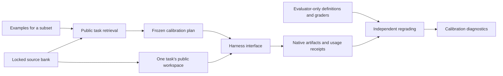

# Employee calibration and task-package experiments

Representative examples are optional and may cover **any subset of employees**.
The simulator owns the full workforce. A user can supply examples for just one
employee without describing every colleague.

This module connects the locked JobBench/Internal EuroBench bank to reproducible
development calibration. It is an extension of the H200 work, not a claim that
the final large-world learning study has been completed.

## Calibrate a subset

The simulator-generated workforce provides employee IDs, roles and languages.
The user supplies only an overlay such as:

```json
{
  "finance-alex": [
    {
      "prompt": "Reconcile supplier invoices against changing tariffs and explain discrepancies.",
      "matches": 2,
      "weight": 1,
      "selector": {"sources": ["internal_eurobench"]}
    }
  ]
}
```

Use the overlay with the existing workforce specification:

```bash
python3 -m worldlab fit \
  --bank ../Big-World-CL/lifespan/artifacts/final-world-calibration-v1 \
  --spec generated-workforce.json --employee-examples employee-examples.json
```

Programmatic callers can use `attach_examples(workforce_spec, examples)` followed
by `fit(bank, specification)`. Neither operation changes the input workforce.
Inline `representative_tasks` remains available in the employee specification.
See [the partial example](../configs/worldlab/partial_employee_examples.json).

Every employee remains in the returned workforce:

| Evidence | Status | Behavior |
|---|---|---|
| Usable examples supplied for this employee | `direct_examples` | Use its retrieved task mixture |
| No examples, but matching role and language have examples | `role_transfer` | Use that role's mixture and record donor IDs and the transfer assumption |
| No applicable matches | `uncalibrated_default` | Return `task_mixture: null` and `default_action: retain_simulator_default` |

`calibration_role` can group differently named job titles; otherwise the exact
role label is used, ignoring case. Languages must match. An employee's own
unmatched examples remain visibly uncovered; they do not silently get replaced
by someone else's examples. No examples at all is valid and leaves everyone on
defaults. The calling simulator is responsible for retaining those defaults;
the current MiroFish runner is not yet wired to this overlay.

The test suite exercises a 100-employee workforce with examples for only one
employee. Transferring its mixture to colleagues does **not** manufacture 99
additional observed examples or calibration replays.

The simulator can also expand `workforce_templates` into a roster. A template
specifies role, language, headcount and default task pool; no employee prompts
are required. IDs are stable, such as `research-en-001`. The user then supplies
the same optional examples overlay. Templates cannot contain representative
examples, so one observation cannot accidentally become every employee's data.
See [the 12-employee coverage configuration](../configs/worldlab/development_coverage_v1.json)
and [its one-employee overlay](../configs/worldlab/development_coverage_examples_v1.json).
These synthetic defaults span three departments and three languages; they are
not measurements of a real workforce. The configuration plans 960 work attempts
per world pair and 36 possible learning epochs, before any outcomes are observed.

## What the fit means

Only calibration-training task briefs are searched. An explicit task-ID selector
must also stay in that partition. The transparent TF-IDF cosine ranking reads
public briefs, never gold, prior outcomes, private criteria, validation briefs or
holdout briefs. Each employee's retrieved tasks have distinct connected lineage
groups. Translations and shared templates remain grouped.

This is task retrieval, not a semantic-equivalence certificate. In the five-person
example, one employee has direct examples, two inherit the same-role mixture and
two retain defaults. `weighted_retrieval_coverage: 1` refers only to finding the
requested number of matches for supplied anchors; it does not mean the entire
workforce has been empirically calibrated. Employee coverage is reported
separately. User-specified weights describe the desired task mixture and are not
measured workplace frequencies.

## Execution boundaries and extension points



`worldlab/contracts.py` defines independent `Harness`, `Learner`, `TaskRequest`,
`Budget` and released `Feedback` contracts. The campaign accepts harness and
grader instances, rather than embedding a model loop in task generation. A new
harness supplies identity, capability checks and execution receipts. It receives
the current public request, workspace, deployed skill and budget; private grading
definitions and sibling tasks stay with the controller.

The implemented harness runs the pinned **native Hermes AIAgent** with its
terminal/file/skill tools in bubblewrap and the already qualified nonstreaming
Responses transport. Every replay has a fresh profile and filesystem. The
physical-call meter enforces token reservations and disables unmetered auxiliary
inference. Logs are outside the task workspace. Original input bytes and all
native outputs are preserved.

The calibration campaign's grader calls the original EuroBench mechanical evaluator. It
returns `quality_score: null` and `quality_judging: not_executed`; mechanical
checks alone are not the frozen qualitative rubric. The following capabilities
remain explicit gaps, and affected tasks are reported as unsupported:

- JobBench research and document-tool qualification.
- Native app state and interactive employee tools.
- Binary document runtime qualification and private executable grading.
- Visual judging and the official JobBench rubric adapter.

The chronological task-world runner now connects native Hermes, the frozen
Internal EuroBench text rubric and pinned SkillOpt. `NoLearning` provides the
matched control. A Fluso adapter remains to be implemented and qualified.

### Chronological task worlds

`worldlab/worlds.py` compiles a complete schedule before execution. Each employee
has a role/language task pool and optional calibration mixture. It maintains
employee skills, delayed feedback, scheduled obligations and work receipts across
days. The current execution mode is controlled skill transfer: each work attempt
starts with fresh files and a fresh harness session. It does not yet simulate
reacting colleagues, long conversations or an economy with consequences.

Training, validation and probe families retain the bank's original separation.
Released learning cases are selected by chronology and lineage, never by score.
SkillOpt sees training feedback; validation stays in evaluator-owned callbacks.
Accepted skill changes affect subsequent work. The final probe phase never enters
learning. Paired arms have identical fixed schedules and opposite execution order
on alternating seeds. An interrupted plan cannot automatically restart.

```bash
python -m worldlab.run_worlds prepare --bank BANK --out OUT \
  --spec configs/worldlab/development_world_v1.json --seeds 211 \
  --hermes-root HERMES --skillopt-root SKILLOPT
python -m worldlab.run_worlds execute --bank BANK --out OUT \
  --hermes-root HERMES --skillopt-root SKILLOPT
python -m worldlab.audit_worlds --bank BANK --out OUT
```

The preparation records source and bank hashes, model/provider identities,
complete schedules and token reservation ceilings. All model costs include
judging: online work, target replays, replay judges and optimizer calls. The
SkillOpt adapter uses the existing pinned upstream implementation, including its
strict mixed-score improvement, per-case nonregression and fresh final validation
gate. It does not substitute a locally invented learning algorithm.

The qualitative judge uses each original frozen r3 criterion and complete text
files, with one metered schema-constrained verdict per criterion. Private rubrics
remain outside the worker sandbox. Judge-derived feedback is a constructed
training signal, not feedback from a natural user. The current judge shares the
solver model; offline audits verify evidence and arithmetic, not judgment truth.

Two format controls passed on H200 at `6602bd1`: an intact editing artifact
scored 1.0 and its copy with the required deliverable removed scored 0.5 and
failed overall. These used eight calls and 26,456 tokens. An earlier unstructured
negative control emitted prose outside JSON and was retained as an incomplete
judgment. Schema-constrained output fixed that formatting failure. Two controls
do not establish broad judge accuracy.

### Adding and scaling harnesses

`Harness.run()` returns normalized trajectory, usage and skill-loading evidence;
`Harness.audit_execution()` independently checks that receipt against native
logs. `PUBLIC_REQUEST.json` is controller-owned. Harness-specific filenames and
skill directories stay inside the adapter. The attempt controller rejects
over-budget, incompletely accounted or wrong-skill receipts before grading.
An alternate adapter test executes without any Hermes files. The existing
calibration CLI retains its older native audit; the task-world API uses the new
adapter contract.

To integrate another harness, implement `identity`, `unsupported`, `run` and
`audit_execution`, then pass the adapter to `prepare_study` and `execute_study`.
Pass its offline auditor to `audit`. A learner supplies `identity` and `update`;
the replay callback remains controller-owned. Native Fluso runtime, isolation,
physical-call accounting and skill-loading evidence must be qualified before
labeling that adapter operational.

Set `max_parallel_employees` in the world specification to run bounded waves of
independent employees. Each employee's sessions remain ordered; daily feedback
and learning wait for the day's work. The scheduler records all started peers if
one fails, retains the wave reservation and stops further dispatch. It never
retries a failed attempt or chooses work according to completion speed. The
frozen `development-world-v2` study at `6602bd1` uses the earlier serial runner;
later adapter and parallel-dispatch changes do not alter its execution checkout.

Native parallel qualification at `3efaa9f` completed on H200: two simultaneous
fresh profiles, both offline audits passed, 20 physical calls and 124,311 tokens.
The frozen plan hash is
`2c085718906eaebc82c56ddc04be44b43bf451f7576b6c1aa866cea0468d77a2`.
Run the reusable qualification with `python -m worldlab.qualify_harness`, passing
`--bank`, `--out`, `--hermes-root`, a development `--task-id` and `--parallel 2`.
This verifies the adapter and metering at that concurrency, not the learning
effect or high-concurrency server capacity.

## Native H200 calibration

The first eligible package slice was chosen by task identity before model calls:
research editing and facilities reconciliation, two fresh executions each, seed
20260915, 32 calls / 8,192 output tokens / 500,000 reserved total tokens / 1,200
seconds per attempt. The combined reservation ceiling is two million tokens.
These are development tasks and dependent repeats, not final test worlds.

The controller uses `/home/inference-testing/benchmarks/eurobench-v1/.venv/bin/python`;
Hermes uses its own pinned environment. The original grader package is separately
hashed at `/home/inference-testing/apps/worldlab-eurobench-331d85b`.

```bash
python -m worldlab prepare --bank BANK --spec configs/worldlab/calibration_h200_v1.json \
  --out OUT --hermes-root HERMES --eurobench-package EUROBENCH
python -m worldlab execute --bank BANK --out OUT \
  --hermes-root HERMES --eurobench-package EUROBENCH
python -m worldlab audit --bank BANK --out OUT --eurobench-package EUROBENCH
```

Preparation makes no model calls and binds source hashes, provider, grader,
task bank, fixed skill, order and budgets. Execution is single-use. Behavioral
failures remain in the results. Infrastructure ambiguity preserves the in-flight
marker, charges an unresolved reservation and stops further dispatch; it never
automatically replays the attempt. The auditor rehashes evidence and reruns the
original mechanical checks. Unsupported and missing slots remain in the report.

The first run, `task-calibration-h200-v1`, exposed harness-generated
`trajectory_samples.jsonl` files in employee workspaces. All four attempts are
preserved with `INVALIDATION.json`; they are not valid employee-performance
evidence. Commit `6487c39` moved the host working directory outside the workspace
and excluded generated Python deliverables from the execution-source inventory.
`task-calibration-h200-v2` completed the same four preselected cases after these
infrastructure corrections. Original mechanical regrading passed its audit. Both
research-editing attempts passed mechanics; both facilities attempts failed them.
All four loaded the exact seed skill, preserved inputs and had no unauthorized
workspace files. The run used 42 physical calls and 642,834 tokens with complete
accounting. Full qualitative judging of all four calibration attempts has not
been executed; the separate judge controls above cover one artifact and its
deliberately incomplete copy.

The invalid first run also consumed 49 calls and 862,695 tokens. Across both
calibration runs, the recorded cost is **91 physical calls and 1,505,529 tokens**.
Those infrastructure costs are retained, not hidden in the corrected-run total.
See [the verified aggregate receipt](h200-task-calibration-v2-summary.json).

The facilities task exposed a separate source-contract concern: its public CSV
brief requests a `justification` column, but the original SQL comparison omits
that column and rejects it as extra. Both outputs hit that check; additional
report checks also failed. The original grader is preserved. This task needs
contract review before interpreting failures as skill-addressable errors or
using its score as a learning reward. No expected answers or checks were altered.

Remote frozen checkouts `Big-World-CL-lab-frozen-v1` and
`Big-World-CL-lab-frozen-v2` preserve each run's execution source for re-auditing.
Run the matching version's auditor with the absolute artifact path; subsequent
development commits intentionally have different source identities.

## Remaining path to the final study

The final objective requires rich employee/world generation using this partial
calibration, long-lived work and consequences, scalable sessions, harness/learner
adapters, calibrated grading and prospectively frozen independent world pairs.
The current task-world runner is a working development component of that system.

Statistical inference must use independent world pairs, not thousands of
dependent sessions or repetitions of the 329 sourced tasks. Freeze the primary
contrast, task-generation version, minimum meaningful effect, budgets and sample
size before final outcomes. Estimate world-pair variability in development;
one pilot pair cannot estimate it. Paired power calculations use the variation
of paired differences ([Statsmodels documentation](https://www.statsmodels.org/stable/_modules/statsmodels/stats/power.html)).
Any paired permutation analysis additionally needs its exchangeability or
random-assignment assumptions to hold ([SciPy documentation](https://docs.scipy.org/doc/scipy/reference/generated/scipy.stats.permutation_test.html)).

A positive score difference with no adopted skill is not evidence of successful
learning. The completed H200 integration pair illustrates that: SkillOpt made
two consolidation epochs and six target replays, spent 686,487 learning tokens,
and adopted no change. Its 43 work attempts versus the control's 42 attempts
produced different outcomes, but both deployed the same seed skill. Both audits
passed. This result establishes execution, accounting and stochastic variation;
it does not meet the requested learning or significance objective.
