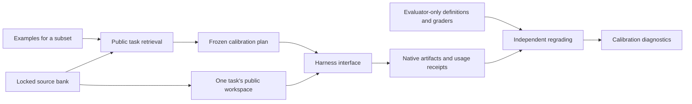

# Employee calibration and task-package experiments

Representative examples are optional and may cover **any subset of employees**.
The simulator owns the full workforce. A user can supply examples for just one
employee without describing every colleague.

Examples for every employee are never required. Supplying no examples at all
is valid. These examples currently calibrate task selection; they do not prove
that an individual's writing style or workplace behavior has been reproduced.

This module connects the locked JobBench/Internal EuroBench bank to reproducible
development calibration. It is an extension of the H200 work, not a claim that
the final large-world learning study has been completed.
The [study protocol](WORLDLAB_STUDY_PROTOCOL.md) records the scale configuration,
required learning evidence and the boundary between development and confirmation.

For a running workplace study, use the read-only progress command on its host:

```bash
python3 scripts/report_worldlab_progress.py \
  --study /path/to/frozen-study-artifacts \
  --service bigworld-native-workplace-scale-v1.service
```

The optional service is an operator-selected systemd user unit. Its current
MainPID and state are reported separately from saved experiment progress; the
command does not start or restart anything. It lists all planned world arms,
completed and unfinished attempts, learning receipts, employee interviews and
unknown accounting. Learner-ledger tokens already include replays, so the report
keeps those categories separate and provides no misleading combined cost total.
An in-flight marker does not prove that a process is alive, and service success
does not prove a successful experiment audit or a learning effect.

To inspect actual learning supply, run `scripts/report_worldlab_readiness.py`
with `--study`, `--bank` and a fresh `--out` outside the study directory. Use the
study's frozen execution sources on `PYTHONPATH`; the reporter checks their
hashes before selecting experiences. It captures published states and binds
completed sessions to their attempt receipts without invoking a model.

The report distinguishes eligibility from feedback released at the recorded
day, supply available by the next scheduled update using only already completed
work, and updates/adoptions actually recorded. Repeated work on one connected
lineage does not count as two training cases. Isolated validation descriptors
remain separate from observed employee experience. Missing arm states are
unobserved, not zero-result employees. This is a nontransactional supply
observation, not a complete work or causal audit, and it does not dispatch an
optimizer or change the scheduled learning days.

For future study sizing, `scripts/plan_worldlab_power.py` reads explicit effect
and paired-world SD scenarios without loading outcomes. It records reproducible
paired-t and bounded-mean sensitivity calculations; it does not select a final N
or change the running study's test. See the [power planning protocol](WORLDLAB_STUDY_PROTOCOL.md#outcome-free-power-sensitivity).
Its optional dependencies are isolated in `requirements-worldlab-planning.txt`.

Fresh native studies can opt into `--meter-social-calls` on both prepare and
execute, or use `MiroFishEmployees(..., meter_social_calls=True)`. The native
qualification command accepts the same flag. This requires the updated bridge,
Reddit worker patch and capability manifest in a separate fresh backend; do not
replace an active study's backend. The option is frozen in the employee identity.
It records otherwise uncontracted Responses calls under each simulation's
`model_usage/`, then retains a copy with the arm for offline auditing. Interviews
keep their existing ledger and are excluded from this new total.

Each call has a receipt before dispatch, zero SDK retries, request/input hashes,
terminal status and any valid provider-reported token counts. Output processing
failures retain known consumption. Missing usage, interrupted calls and missing
ledgers never become measured zeroes. Concurrent simulations use separate
directories; prompts, outputs, credentials and exception messages are omitted.
`social_model_usage` reports these calls separately from interview costs. It
does not establish complete accounting for other bootstrap providers, evaluator
accuracy or a learning effect. Existing unmetered runs remain unchanged.

## Calibrate a subset

Calibration examples and learner validation serve different purposes. Examples
are optional observations used to fit a training-task mixture. A learner's
validation cases come from the separately partitioned benchmark bank; the user
does not need to supply examples for them or for every employee.

The simulator-generated workforce provides employee IDs, roles and languages.
The user supplies only an overlay such as:

```json
{
  "finance-alex": [
    {
      "prompt": "Reconcile supplier invoices against changing tariffs and explain discrepancies.",
      "matches": 2,
      "weight": 1,
      "selector": {"sources": ["internal_eurobench"]}
    }
  ]
}
```

Use the overlay with the existing workforce specification:

```bash
python3 -m worldlab fit \
  --bank ../Big-World-CL/lifespan/artifacts/final-world-calibration-v1 \
  --spec generated-workforce.json --employee-examples employee-examples.json
```

Programmatic callers can use `attach_examples(workforce_spec, examples)` followed
by `fit(bank, specification)`. Neither operation changes the input workforce.
Inline `representative_tasks` remains available in the employee specification.
See [the partial example](../configs/worldlab/partial_employee_examples.json).

Every employee remains in the returned workforce:

| Evidence | Status | Behavior |
|---|---|---|
| Usable examples supplied for this employee | `direct_examples` | Use its retrieved task mixture |
| No examples, but matching role and language have examples | `role_transfer` | Use that role's mixture and record donor IDs and the transfer assumption |
| No applicable matches | `uncalibrated_default` | Return `task_mixture: null` and `default_action: retain_simulator_default` |

`calibration_role` can group differently named job titles; otherwise the exact
role label is used, ignoring case. Languages must match. An employee's own
unmatched examples remain visibly uncovered; they do not silently get replaced
by someone else's examples. No examples at all is valid and leaves everyone on
defaults. The calling simulator is responsible for retaining those defaults;
the optional native employee mode uses this calibrated workforce and role-based arrival schedule.

The test suite exercises a 100-employee workforce with examples for only one
employee. Transferring its mixture to colleagues does **not** manufacture 99
additional observed examples or calibration replays.

For a new study, `validation_context: isolated_public_tasks_v1` keeps gate cases
outside the live workplace. See
[the two-employee configuration](../configs/worldlab/development_workplace_isolated_validation_v1.json).
The compiler selects distinct validation families before any outcomes, using a
separate random stream. All ordinary pre-probe arrivals use the training pool;
the same number of arrivals, deadlines and work opportunities is retained.
Gate descriptors contain public task identities and budgets, with no invented
completed attempt or observed feedback. The learner measures them through fresh
replays, using the original public instruction without employee context. These
replays are charged to its existing learning budget.

The employee adapter receives no gate catalog. Gate briefs, attempts and feedback
never enter employee views, notes, colleague messages, queues or utility. Live
training feedback and post-learning probe behavior retain their normal timing.
The same validation cases are reused across updates, so they remain development
selection data rather than an unbiased final performance estimate. Arbitrary
learner adapters still own their reflection policy and audit; the native SkillOpt
test checks that validation-only canaries stay out of reflection. This routing
does not establish judge correctness or absence of model pretraining contamination.

Omitting `validation_context` retains the historical `workplace_history` protocol,
whose employee context can expose released validation outcomes to later training
requests. Existing frozen studies keep that protocol. The isolated mode changes
the work distribution and must be prepared as a fresh study, with a newly frozen
analysis plan; it cannot repair or replace the evidence of an existing run.

The simulator can also expand `workforce_templates` into a roster. A template
specifies role, language, headcount and default task pool; no employee prompts
are required. IDs are stable, such as `research-en-001`. The user then supplies
the same optional examples overlay. Templates cannot contain representative
examples, so one observation cannot accidentally become every employee's data.
See [the 12-employee coverage configuration](../configs/worldlab/development_coverage_v1.json)
and [its one-employee overlay](../configs/worldlab/development_coverage_examples_v1.json).
These synthetic defaults span three departments and three languages; they are
not measurements of a real workforce. The configuration plans 960 work attempts
per world pair and 36 possible learning epochs, before any outcomes are observed.

## What the fit means

Only calibration-training task briefs are searched. An explicit task-ID selector
must also stay in that partition. The transparent TF-IDF cosine ranking reads
public briefs, never gold, prior outcomes, private criteria, validation briefs or
holdout briefs. Each employee's retrieved tasks have distinct connected lineage
groups. Translations and shared templates remain grouped.

This is task retrieval, not a semantic-equivalence certificate. In the five-person
example, one employee has direct examples, two inherit the same-role mixture and
two retain defaults. `weighted_retrieval_coverage: 1` refers only to finding the
requested number of matches for supplied anchors; it does not mean the entire
workforce has been empirically calibrated. Employee coverage is reported
separately. User-specified weights describe the desired task mixture and are not
measured workplace frequencies.

The world compiler separately reports `calibration_application`: the retrieved
weight actually available in that employee's supported training pool and any
unavailable matched task IDs. Finding an example is not enough to call it applied
when the selected harness cannot execute it; those employees retain defaults.

## Execution boundaries and extension points



`worldlab/contracts.py` defines independent `Harness`, `Learner`, `TaskRequest`,
`Budget` and released `Feedback` contracts. The campaign accepts harness and
grader instances, rather than embedding a model loop in task generation. A new
harness supplies identity, capability checks and execution receipts. It receives
the current public request, workspace, deployed skill and budget; private grading
definitions and sibling tasks stay with the controller.

The implemented harness runs the pinned **native Hermes AIAgent** with its
terminal/file/skill tools in bubblewrap and the already qualified nonstreaming
Responses transport. Every replay has a fresh profile and filesystem. The
physical-call meter enforces token reservations and disables unmetered auxiliary
inference. Logs are outside the task workspace. Original input bytes and all
native outputs are preserved.

The calibration campaign's grader calls the original EuroBench mechanical evaluator. It
returns `quality_score: null` and `quality_judging: not_executed`; mechanical
checks alone are not the frozen qualitative rubric. The following capabilities
remain explicit gaps, and affected tasks are reported as unsupported:

- JobBench research and document-tool qualification.
- Native app state and interactive employee tools.
- Binary document runtime qualification and private executable grading.
- Visual judging and the official JobBench rubric adapter.

The chronological task-world runner now connects native Hermes, the frozen
Internal EuroBench text rubric and pinned SkillOpt. `NoLearning` provides the
matched control. A Fluso adapter remains to be implemented and qualified.

### Chronological task worlds

`worldlab/worlds.py` compiles a complete schedule before execution. Each employee
has a role/language task pool and optional calibration mixture. It maintains
employee skills, delayed feedback, scheduled obligations and work receipts across
days. The current execution mode is controlled skill transfer: each work attempt
starts with fresh files and a fresh harness session. Its optional native employee mode adds reacting colleagues and persistent workplace consequences, described below. Neither mode currently supplies long multiturn user conversations or a broader institutional economy.

Training, validation and probe families retain the bank's original separation.
Released learning cases are selected by chronology and lineage, never by score.
SkillOpt sees training feedback; validation stays in evaluator-owned callbacks.
Accepted skill changes affect subsequent work. The final probe phase never enters
learning. Paired arms have identical fixed schedules and opposite execution order
on alternating seeds. An interrupted plan cannot automatically restart.

```bash
python -m worldlab.run_worlds prepare --bank BANK --out OUT \
  --spec configs/worldlab/development_world_v1.json --seeds 211 \
  --hermes-root HERMES --skillopt-root SKILLOPT
python -m worldlab.run_worlds execute --bank BANK --out OUT \
  --hermes-root HERMES --skillopt-root SKILLOPT
python -m worldlab.audit_worlds --bank BANK --out OUT
```

For operator-supplied adapters, replace `--hermes-root` with `--harness-config FILE`
and/or `--skillopt-root` with `--learner-config FILE` in both prepare and execute.
Use `--judge-config FILE` to select a different evaluator through the same
factory mechanism. The built-in example is
`configs/worldlab/h200_judge_factory_v1.json`; it binds the verified bank,
model, endpoint and token ceiling. The evaluator may use a different model.
Each JSON file contains exactly `factory` (an importable `module:attribute`) and
`kwargs` (constructor arguments). The factory implements the `Harness`, `Learner` or `Judge`
protocol in `worldlab/contracts.py`; it supplies native receipts and an honest
identity including its external dependency versions. The experimental learner's
name must be a safe path component distinct from the reserved `no_learning` arm.
The loader additionally binds configuration bytes and factory-module bytes in the
frozen identity. Changed factories/configurations fail before execution. Keep
credentials in the runtime environment. Only operator-selected trusted code is
loaded; task files do not select adapters.

A judge implements `identity`, `unsupported`, `grade` and `audit_grade`, with a
positive `max_tokens` ceiling. Only the evaluator receives the bank and private
rubrics. Complete receipts provide `success` (Boolean), `quality_score` in
`[0, 1]`, textual `feedback`, and physical call/token accounting. Invalid or
nonfinite scores, incomplete accounting, and exceeded allocations are rejected
before feedback is released. If either model identity is unavailable, same-model
status remains unknown rather than asserting independence.

The shared auditor binds original task inputs, deployed skills, full attempt
inventories and combined costs. The judge's auditor verifies its own evidence
format, original criteria, aggregation and usage receipts for both online work
and learning replays. It need not create Internal EuroBench's `rubric.json` or
`GRADE.json`. The built-in r3 scorer retains its original checks behind this
interface. Configured judges require their exact frozen identity during audit;
a name matching the built-in judge cannot bypass the factory requirement.
The prospective analysis also freezes and forwards `--judge-config`, and rejects
a missing or mismatched judge configuration before study execution.

An end-to-end fixture checks a complete 20-session world pair plus a learner
replay using binary evidence, an alternate native verdict format, and no r3
rubric files. It also checks tampered grades and factory changes. This is
interface validation, not JobBench document/research qualification, independent
judge calibration, or evidence of skill learning. Existing frozen studies must
continue using their original executable and analysis source.

`configs/worldlab/h200_hermes_factory_v1.json` and
`configs/worldlab/h200_skillopt_factory_v1.json` select the installed H200 baseline
without changing its parameters. A custom harness audit uses the same
`--harness-config FILE` with `worldlab.audit_worlds`. A Fluso implementation can
use this interface, but no operational Fluso adapter is bundled yet.

The preparation records source and bank hashes, model/provider identities,
complete schedules and token reservation ceilings. All model costs include
judging: online work, target replays, replay judges and optimizer calls. The
SkillOpt adapter uses the existing pinned upstream implementation, including its
strict mixed-score improvement, per-case nonregression and fresh final validation
gate. It does not substitute a locally invented learning algorithm.

The qualitative judge explicitly uses temperature zero and top-p one; these
sampling parameters are enforced at dispatch and retained in metering for audit.
Actor and solver sampling are configured independently. Greedy decoding does not
guarantee semantic accuracy or identical results across different GPU batches.
The qualitative judge uses each original frozen r3 criterion and complete text
files, with a metered schema-constrained verdict or a registered source check per criterion. Private rubrics
remain outside the worker sandbox. Judge-derived feedback is a constructed
training signal, not feedback from a natural user. The current judge shares the
solver model; offline audits verify evidence and arithmetic, not judgment truth.

Two format controls passed on H200 at `6602bd1`: an intact editing artifact
scored 1.0 and its copy with the required deliverable removed scored 0.5 and
failed overall. These used eight calls and 26,456 tokens. An earlier unstructured
negative control emitted prose outside JSON and was retained as an incomplete
judgment. Schema-constrained output fixed that formatting failure. Two controls
do not establish broad judge accuracy.

The running `development-world-v2` study subsequently exposed a semantic
contradiction: `fig54_exact_count` returned `passed: false`, while its explanation
counted three occurrences and concluded the criterion passed. Direct file
inspection confirmed three corresponding references. Its original outcomes
remain unchanged, with a `JUDGE_QUALIFICATION_LIMITATION.json` sidecar restricting
interpretation to engineering evidence. The prepared 960-attempt coverage plan
was cancelled before any dispatch because it contained that judge version.

Judge version 3 emits evidence and a short justification before its Boolean
decision. The shared production transport passed 12 fixed count controls on H200:
three repetitions each of the original three references, a case-variation copy,
an extra-reference copy and a missing-reference copy. All twelve decisions matched
independently counted expectations; 12 calls consumed 72,120 tokens. This is a
qualification of that diagnosed count error and decision format, not broad
semantic accuracy. Plan SHA:
`1638ba837cb46de0a92f754f26ab39aca850314c8d929c2b2b1cacfbfbeec6fd`.
The reusable diagnostic is `python -m worldlab.qualify_judge`; it writes new
evidence and never changes the original study's grades or learning feedback.

### Adding and scaling harnesses

Learners also supply `audit_update(artifact_root, update, *, skill_before,
expected_identity)`. The world auditor owns chronology, released train/validation
selection, replay scores and costs, and later skill deployment. The learner's
auditor owns proposal provenance and its acceptance policy. A different learner
does not need to imitate SkillOpt's `configuration`, `optimizer_inputs` or gate
record format. The native SkillOpt implementation still runs its original gate
checker and additionally binds the recorded configuration, incoming/outgoing skill
hashes and optimizer transport receipts to its frozen identity and ledger.

All non-control learners return the common fields `status`, `accepted`, `skill`,
`train_ids`, `validation_ids`, `replay_evidence` and `costs`. Scored replay records
identify the selected experience, zero-based attempt index, hard/soft score and
skill-content hash. Target cost operations remain in that attempt order and
include solver and judge usage. They point to the controller-created
`replay-NNN` directories; algorithm-specific evidence can live alongside them.
The adapter's policy auditor remains responsible for verifying how optimizer
inputs and proposals were derived, including keeping validation out of training.

Supply `--judge-config`, `--learner-config` and `--harness-config` to
`python -m worldlab.audit_worlds` when those factories were used. A configured
implementation cannot silently use a built-in auditor just because its name
matches. Factory preparation requires the learner audit method before dispatch.
The non-SkillOpt routing test uses a deterministic rule fixture; it is interface
evidence, not a demonstrated learning algorithm.

`Harness.run()` returns normalized trajectory, usage and skill-loading evidence;
`Harness.audit_execution()` independently checks that receipt against native
logs. `PUBLIC_REQUEST.json` is controller-owned. Harness-specific filenames and
skill directories stay inside the adapter. The attempt controller rejects
over-budget, incompletely accounted or wrong-skill receipts before grading.
An alternate adapter test executes without any Hermes files. The existing
calibration CLI retains its older native audit; the task-world API uses the new
adapter contract.

To integrate another harness, implement `identity`, `unsupported`, `run` and
`audit_execution`, then pass the adapter to `prepare_study` and `execute_study`.
Pass its offline auditor to `audit`. A learner supplies `identity` and `update`;
the replay callback remains controller-owned. Native Fluso runtime, isolation,
physical-call accounting and skill-loading evidence must be qualified before
labeling that adapter operational.

Set `max_parallel_employees` in the world specification to run bounded waves of
independent employees. Each employee's sessions remain ordered; daily feedback
and learning wait for the day's work. The scheduler records all started peers if
one fails, retains the wave reservation and stops further dispatch. It never
retries a failed attempt or chooses work according to completion speed. The
frozen `development-world-v2` study at `6602bd1` uses the earlier serial runner;
later adapter and parallel-dispatch changes do not alter its execution checkout.

Native parallel qualification at `3efaa9f` completed on H200: two simultaneous
fresh profiles, both offline audits passed, 20 physical calls and 124,311 tokens.
The frozen plan hash is
`2c085718906eaebc82c56ddc04be44b43bf451f7576b6c1aa866cea0468d77a2`.
Run the reusable qualification with `python -m worldlab.qualify_harness`, passing
`--bank`, `--out`, `--hermes-root`, a development `--task-id` and `--parallel 2`.
This verifies the adapter and metering at that concurrency, not the learning
effect or high-concurrency server capacity.

## Native H200 calibration

The first eligible package slice was chosen by task identity before model calls:
research editing and facilities reconciliation, two fresh executions each, seed
20260915, 32 calls / 8,192 output tokens / 500,000 reserved total tokens / 1,200
seconds per attempt. The combined reservation ceiling is two million tokens.
These are development tasks and dependent repeats, not final test worlds.

The controller uses `/home/inference-testing/benchmarks/eurobench-v1/.venv/bin/python`;
Hermes uses its own pinned environment. The original grader package is separately
hashed at `/home/inference-testing/apps/worldlab-eurobench-331d85b`.

```bash
python -m worldlab prepare --bank BANK --spec configs/worldlab/calibration_h200_v1.json \
  --out OUT --hermes-root HERMES --eurobench-package EUROBENCH
python -m worldlab execute --bank BANK --out OUT \
  --hermes-root HERMES --eurobench-package EUROBENCH
python -m worldlab audit --bank BANK --out OUT --eurobench-package EUROBENCH
```

Preparation makes no model calls and binds source hashes, provider, grader,
task bank, fixed skill, order and budgets. Execution is single-use. Behavioral
failures remain in the results. Infrastructure ambiguity preserves the in-flight
marker, charges an unresolved reservation and stops further dispatch; it never
automatically replays the attempt. The auditor rehashes evidence and reruns the
original mechanical checks. Unsupported and missing slots remain in the report.

The first run, `task-calibration-h200-v1`, exposed harness-generated
`trajectory_samples.jsonl` files in employee workspaces. All four attempts are
preserved with `INVALIDATION.json`; they are not valid employee-performance
evidence. Commit `6487c39` moved the host working directory outside the workspace
and excluded generated Python deliverables from the execution-source inventory.
`task-calibration-h200-v2` completed the same four preselected cases after these
infrastructure corrections. Original mechanical regrading passed its audit. Both
research-editing attempts passed mechanics; both facilities attempts failed them.
All four loaded the exact seed skill, preserved inputs and had no unauthorized
workspace files. The run used 42 physical calls and 642,834 tokens with complete
accounting. Full qualitative judging of all four calibration attempts has not
been executed; the separate judge controls above cover one artifact and its
deliberately incomplete copy.

The invalid first run also consumed 49 calls and 862,695 tokens. Across both
calibration runs, the recorded cost is **91 physical calls and 1,505,529 tokens**.
Those infrastructure costs are retained, not hidden in the corrected-run total.
See [the verified aggregate receipt](h200-task-calibration-v2-summary.json).

The facilities task exposed a separate source-contract concern: its public CSV
brief requests a `justification` column, but the original SQL comparison omits
that column and rejects it as extra. Both outputs hit that check; additional
report checks also failed. The original grader is preserved. This task needs
contract review before interpreting failures as skill-addressable errors or
using its score as a learning reward. No expected answers or checks were altered.

Remote frozen checkouts `Big-World-CL-lab-frozen-v1` and
`Big-World-CL-lab-frozen-v2` preserve each run's execution source for re-auditing.
Run the matching version's auditor with the absolute artifact path; subsequent
development commits intentionally have different source identities.

## Remaining path to the final study

The final objective requires rich employee/world generation using this partial
calibration, long-lived work and consequences, scalable sessions, harness/learner
adapters, calibrated grading and prospectively frozen independent world pairs.
The current task-world runner is a working development component of that system.

Statistical inference must use independent world pairs, not thousands of
dependent sessions or repetitions of the 329 sourced tasks. Freeze the primary
contrast, task-generation version, minimum meaningful effect, budgets and sample
size before final outcomes. Estimate world-pair variability in development;
one pilot pair cannot estimate it. Paired power calculations use the variation
of paired differences ([Statsmodels documentation](https://www.statsmodels.org/stable/_modules/statsmodels/stats/power.html)).
Any paired permutation analysis additionally needs its exchangeability or
random-assignment assumptions to hold ([SciPy documentation](https://docs.scipy.org/doc/scipy/reference/generated/scipy.stats.permutation_test.html)).

A positive score difference with no adopted skill is not evidence of successful
learning. The completed H200 integration pair illustrates that: SkillOpt made
two consolidation epochs and six target replays, spent 686,487 learning tokens,
and adopted no change. Its 43 work attempts versus the control's 42 attempts
produced different outcomes, but both deployed the same seed skill. Both audits
passed. This result establishes execution, accounting and stochastic variation;
it does not meet the requested learning or significance objective.


## Optional native employee workplace

Pass `--mirofish-backend BACKEND --persona-cache CACHE` and
`--mirofish-service-url http://127.0.0.1:5001` to both `worldlab.run_worlds prepare` and `execute`.
The explicit native provider environment must match the frozen model/base URL;
see the H200 runbook. The backend directory is independent of the frozen controller
checkout, so no copied or changed MiroFish source is needed in each worktree.

`EmployeeFactory` freezes persona context and opens a new persistent driver for
each arm. `EmployeeDriver` receives an exact released view, returns an auditable
decision, reports interview costs and closes its own native environment. The
current adapter uses actual pinned Persona 8B profiles in MiroFish/OASIS.
Swapping the work harness or learner does not require changing this driver.

`workplace` parameters in the specification control `max_attempts` (default 2),
`retry_delay` (1 day), `grace_days` (2), `settlement_delay` (1),
`work_cost_units` (1) and `completion_value_units` (10). Employee
`sessions_per_day` is available daily capacity. `arrivals_per_day` independently
sets new obligations per day, defaulting to that capacity for older specs. Both
are integers from 1 to 64. Independent arrival/capacity settings require the native
workplace mode. Work arrives on the frozen role/calibration schedule. A failure can occupy later capacity through rework;
a deferral leaves the obligation pending and consumes that day's opportunity.
The observation window then drains feedback and payments without extra work.
Work and actor reservations cover all capacity slots, including rework, even when
there are fewer new obligations. `planned_obligations` counts incoming work;
the preparation result's `planned_work_sessions` is the maximum delegation count.
`configs/worldlab/development_workplace_v1.json` declares two colleagues, one new
task per employee/day, two daily work slots, a two-day deadline, delayed feedback
and a fixed day-six learning opportunity. This is an integration protocol, not a
sample-size justification or a final significance study.

Native decisions retain private working notes and can send one message to a
listed colleague in the same department. Messages and grade feedback arrive
later. Actors cannot see future task briefs, hidden grading evidence or another
employee's private files. Original task requirements remain in each solver
request; the actor's request is recorded separately and reused unchanged during
learning replays. The grader still uses the original task's rubric and brief.

Actor JSON uses the same supported schema for generation and acceptance. Text
length is controlled with prompt guidance (brief notes, short messages, a useful
request), not post-generation character limits. The inference request still
enforces its output-token budget. JSON types, required keys, enums and supported
array/numeric constraints remain structured. Business checks still enforce
visible evidence, permitted recipients and available work.

`python -m worldlab.inference_gateway --concurrency 64 --port 8011 --upstream http://127.0.0.1:8002`
serves the current H200 model through a shared loopback OpenAI-compatible endpoint.
Install `requirements-inference-gateway.txt` in its own environment.
Point all participating solver, employee, judge and learner providers at
`http://127.0.0.1:8011/v1`, the default for WorldLab commands. The gateway holds a slot through the complete response,
including streamed output, and queues excess calls. It does not change request
or response bytes, retry calls, or log prompts. `/status` reports the configured
limit, live and peak concurrency, queue depth and failures. Calls made directly
to the underlying model server are outside this shared limit. Existing frozen
experiments retain their original providers; use `--base-url` for other deployments.

New gateway source defaults to a fresh upstream TCP connection for each request;
`--connection-policy keepalive` selects the comparison policy. The same 64-call
limit holds through response EOF. `/status` binds the implementation hash,
aiohttp version, connection policy and connection counts. Failure diagnostics
record stage, exception class, HTTP status, connection reuse and byte counts;
they omit bodies, queries, credentials and exception messages. `--events` writes
to a fresh JSONL file or the service journal is used. A gateway-generated
`X-Request-ID` links the error event to the native Hermes physical-call receipt.
No retry is added and unknown usage keeps its original reservation.

`python -m worldlab.qualify_gateway --out FRESH_OUT` runs 1,088 synthetic native
requests: warmup, counterbalanced keepalive/fresh phases, then a fresh-connection
stress phase, all at a maximum concurrency of 64. It retains every request and
response across Responses JSON, Chat JSON and Chat SSE, together with serving
identity and per-phase metrics. Run when other callers of that model are idle;
qualification phases use one ephemeral gateway at a time. Tiny completions and
repeated context make this a transport check, not a workplace throughput result.
The fresh-connection fixture does not establish the cause of the old HTTP 502.

Future Chat Completions harnesses can use `worldlab.chat_budget_gateway` for a
separate **per-attempt** budget ahead of that shared gateway. Each instance owns
a fresh private Unix socket and receipt directory. It tokenizes the actual
text/tool prompt on the configured vLLM server, reserves input plus the allowed
completion tokens, and writes the completion cap into the inference request.
It preserves requested structured-output fields. It neither truncates prompts
nor imposes a character limit. The qualified profile pins one model, one choice,
automatic tool selection and disabled thinking; unqualified prompt-rendering or
multimodal options are rejected before generation.

JSON and SSE response bytes are retained outside the harness workspace. The
meter waits through provider EOF, validates usage, and refunds unused reserved
tokens. A failed request or missing usage stops further inference and preserves
its reservation; an observed overrun preserves actual usage and stops the
attempt. Model-list requests and recorded tokenizer preflights are separate
from physical generation calls. Native auxiliary calls must use the same
attempt endpoint. Requests within one attempt are serialized; independent
attempts still share the global 64-call limit. The controller must terminate
the harness when its budget or transport stops.

`worldlab.chat_budget_gateway.audit_meter` recomputes bounds and charges from
retained tokenizer, request and response bytes. It can validate the accounting
of a failed attempt; a passing meter audit does not imply task success. The
module does not itself isolate a harness, install/read its skill, normalize its
native trajectory, or provide a complete Fluso adapter. An adapter must
supply those parts and expose only its own fixed relay to the solver. The
ongoing Hermes study continues to use its original native budget meter.

Run `python -m worldlab.qualify_chat_budget --out FRESH_OUT` from the source to
check two synthetic requests through a Unix socket against Qwen: structured
JSON and a streamed tool call. Its defaults use the shared gateway on 8011 and
the model's tokenizer on 8002. This is a bounded component qualification, not
a Fluso benchmark or learning run. Dependencies are the same optional
`requirements-inference-gateway.txt`. Reproduce older receipt audits using their
frozen source version.

`worldlab.chat_relay` exposes only model listing and Chat Completions from a
controller-owned Unix socket. It forwards native JSON/SSE bytes immediately,
discards client authorization and routing headers, and never retries. For the
prospective Fluso integration, the relay runs in a Docker `--network none`
container. Fluso shares only that container's network namespace and reaches
the relay over loopback; it has no host or internet network interface. The Unix
socket and receipt directory remain outside Fluso's mounts.

`python -m worldlab.qualify_fluso_isolation --out FRESH_OUT` exercises this
topology on H200 using the existing immutable Fluso runtime image. A probe with
the same mounts and network as the solver checks model access, blocked private
routes, missing controller files, no external TCP/DNS and a loopback-only
interface list. A synthetic Fluso task then reads a supplied CSV and installed
work-process skill and writes a JSON result. All primary and auxiliary requests
share one budget. The controller records Docker configuration, native logs,
usage and cleanup. These are integration controls; full native skill-read audit,
trajectory normalization, the production Harness contract and task capability
qualification remain separate requirements. No benchmark score or learning
effect follows from this control.

`worldlab.fluso_evidence.audit_skill_and_responses` checks primary assistant
responses and their usage against retained provider bytes, reconstructs a common
trajectory, and links an exact native skill read to consumption in a subsequent
inference request. It reports auxiliary calls separately from primary turns.
For new adapter receipts it also checks the original task prompt in the first
inference input and matches each native tool result to its consuming request.
Use it alongside the matching meter audit; it does not verify other tool effects,
the complete runtime event history, isolation or benchmark scoring. The relay
drains accepted requests after Fluso exits, and the controller finishes that
drain before auditing usage, including background working-memory calls.

The `worldlab.fluso:Fluso` adapter implements the same `Harness` interface as
Hermes. Select `configs/worldlab/fluso_h200_v1.json` with `--harness-config` in
world preparation/execution or native harness qualification. Install
`requirements-worldlab-fluso.txt` in a separate controller environment; the
immutable native Docker image remains the execution runtime. No employee,
learner or judge implementation changes are needed to select the adapter.

Each attempt mounts its public workspace at the native project's `task/`
directory. Fluso project metadata and background memory stay outside the files
that the task grader examines. The requested skill is a separate read-only
mount. The adapter verifies actual Docker image, network, mount, privilege and
resource configuration before starting the native solver, then retains its
exit state and removal receipts. All primary and auxiliary inference shares
the attempt meter and global concurrency limit. Native task and terminal-case
qualification is required before including this adapter in a study. The
[H200 execution ledger](H200_WORLD_STUDIES.md) records two audited development
task executions and native call/token budget-stop controls at source `effc7435`.
A full Fluso learning epoch remains to be qualified; these task controls do not
establish broad task capability.

The current adapter requires Linux pidfds and a user systemd manager. Before
creating containers it starts an independent, bounded `worldlab.fluso_guardian`
service. The service watches the exact controller process and a cleanup
deadline, outside the controller's service/process group. Only containers with
the attempt's exact names, pinned image and unique owner label can be removed;
mutation uses inspected immutable container IDs. Repeated scans catch delayed
container creation. A failed Docker listing never counts as successful cleanup.

Normal completion requires the guardian's acknowledgement of hashed cleanup and
result receipts. Controller death or a cleanup deadline produces separate
interruption evidence and removes owned containers without changing retained
model accounting. Such an attempt remains ungraded; unknown usage reservations
cannot be converted into reported usage. Guardian source and ownership are bound
to the harness identity and execution audit. Native interruption qualification
is required before relying on this behavior in a study. This is bounded cleanup
on a functioning Docker/systemd host, not recovery from host or daemon failure.

Completed receipts require a full skill read and subsequent consumption, a
completed primary assistant turn, validated provider usage and clean container
shutdown. Unknown usage keeps its reservation and withholds grading. A budget
stop without a qualified final native trace is explicitly recorded as
`budget_exhausted_unverified`; it cannot supply a learning trajectory or be
silently counted as a scored task. JobBench, document formats, external apps,
interactive user turns and additional native terminal forms still need their
own capability checks. The initial adapter does not imply those are qualified.

For example, qualify two fresh development tasks before preparing a new study:

```bash
python -m worldlab.qualify_harness \
  --bank /path/to/final-world-calibration-v1 \
  --harness-config configs/worldlab/fluso_h200_v1.json \
  --task-id internal/euw_fr_003_en_bridge --parallel 2 --out /path/to/fresh-qualification
```

The new `development_workplace_concurrency64_v1.json` configuration sets work,
world-pair and employee-update concurrency ceilings to 64 and keeps validation
cases outside the live workplace. World pairs use separate processes, preserving
their counterbalanced arm order. Independent employee epochs also use separate
processes, so upstream SkillOpt's global lock and temporary settings cannot
serialize or contaminate other employees. Within an employee's epoch the native
replay and validation sequence is preserved. The shared inference gateway caps
aggregate model requests, even when more work processes are ready.

The original `max_parallel_employees` controls concurrent work attempts;
`max_parallel_worlds` and `max_parallel_updates` default to one for existing specs.
Parallel modes require adapters that can be serialized into spawned processes,
which preparation checks before dispatch. All started work is joined, failures
are retained, and the final report still requires every planned pair. Native
optimizer edit arrays now use a registered JSON schema in the inference request,
with request hashes checked by the offline auditor. Text fields have no hard
character limits; required structure and original business/gate checks remain.

The offline audit reconstructs every causal command, regenerates visible views,
checks native interview receipts and binds outcomes to actual task artifacts.
All planned probes remain in the denominator. The primary workplace metric is
on-time accepted work; soft quality and configured synthetic utility are secondary.
Bootstrap/social model costs remain unmetered and explicitly unknown. The Fluso
adapter has bounded native task qualification; a full Fluso study, multiturn
employee channel, qualified JobBench document solver, human-calibrated judge and
completed final significance study remain outstanding.


The judge keeps original r3 criterion bytes. Its registered exact-reference-count
predicate checks the full criterion definition and original source count before
handling that criterion without a model call. It records match offsets and is
recomputed by the offline auditor. Other criteria remain model judged, using a
compact JSON schema with concise-text prompt guidance; these judgments still need independent semantic
calibration. Deterministic control passes are never reported as model accuracy.


Native employee mode now seeds the declared employee/department graph directly
through MiroFish's local graph implementation, with native episode storage,
validation and API readbacks. No task or feedback content enters that initial
graph. The old social-media ontology generator is not needed for known simulator
assignments. Automatic graph-memory extraction is disabled in this mode; native
interview history, employee notes and delayed messages still persist. The two-role
native qualification passed; full workplace learning remains to be demonstrated.

For long nonstreaming tool responses, the Hermes adapter configures both native
request and stale-response windows to the lesser of 600 seconds and the whole
attempt budget. It verifies the effective values before dispatch and audits their
saved readbacks. No transport retry or increase in total calls/tokens is implied.

## Cross-checking evaluator coverage

`python -m worldlab.mechanical_diagnostic run --bank BANK --eurobench-root PACKAGE
--roots STUDY_OR_QUALIFICATION ... --out FRESH_OUT` snapshots all available attempt
receipts, verifies their original files and then runs the original EuroBench
mechanics without model calls. The output must be outside every source root.
The `audit` subcommand reruns these checks against the frozen snapshot; later
attempts from a live source do not enter it. On H200 this diagnostic needs
`/home/inference-testing/benchmarks/eurobench-v1/.venv/bin/python`, which contains
the original evaluator's document dependencies.

Mechanical disagreement is not automatically a qualitative false positive.
Original exact-match checks can conflict with the source-corrected r3 contract,
including optional benefits and translated labels. Conversely, the current r3
reward can miss quantitative errors outside its criterion coverage. Full-task
success must eventually cover both valid structural/numerical obligations and
source-grounded qualitative requirements. Neither score alone currently proves it.

`worldlab.qualify_semantics` freezes source-grounded positive and negative controls
before calling the production judge. Its first suite has 11 cases, three repeats
each, over one English benefits-synthesis family. It checks optional content,
semantic paraphrases, threshold direction, invented guarantees, exact headings
and appendix ordering. These are constructed evaluator controls, never solver
performance or employee training data; passing them does not establish general
professional-quality calibration.

`worldlab.qualify_semantic_suite` adds a separately prepared, concurrent suite
with **38 cases: 18 positive and 20 negative**. It includes the 11 English
association controls, 13 German receivables-reconciliation controls and 14 French
coordination-letter controls. Reviewed task, rubric and input hashes prevent a
changed source package from silently reusing old labels. Controls cover permitted
paraphrases, locale number formatting, equivalent JSON Unicode escapes, signed
differences, cancelled receivables, contradictory deliverables, source precedence,
exact schema types/order, stale subjects and unsupported commercial commitments.

Prepare from a source checkout that will remain frozen through execution and
audit. Two repetitions produce 76 evaluations with model concurrency 64. In the
latest source, 74 evaluations require model calls and two use the registered
missing-heading veto without a model call:

```bash
python -m worldlab.qualify_semantic_suite prepare \
  --bank /path/to/final-world-calibration-v1 \
  --model Qwen/Qwen3.8-Flash-Next-FP8 \
  --base-url http://127.0.0.1:8011/v1 \
  --out /path/to/new-semantic-qualification
python -m worldlab.qualify_semantic_suite run --out /path/to/new-semantic-qualification
python -m worldlab.qualify_semantic_suite audit --out /path/to/new-semantic-qualification
```

Preparation dispatches nothing. Execution freezes each slot's model/source-rule
method and retains every planned response. Model slots charge one metered request;
source-rule slots make no API call. Valid failures, format failures and unknown
usage are never retried. Failed setup with no dispatch is reported separately
from unknown provider usage. A failed or interrupted output directory cannot be
resumed. The offline audit checks original case/request bytes, structured-output
and prompt hashes, label agreement, accounting and the complete planned roster.
Only payload evidence and criteria reach the model; expected labels and label
rationales stay in the qualification controller.

The original 76-call suite completed with known usage but matched 75 labels.
One model response invented the required `## Network` heading in a candidate
where it was absent. That failed qualification remains preserved. The new
source-bound veto checks the exact reviewed criterion, public instruction and
input text hashes, and returns failure only when required heading text is absent.
Presence falls through to model judgment; it does not establish coherent prose,
correct factual organization or a fully compliant artifact. Text hashes follow
the same newline normalization as the judge's evidence reader.

The suite's fixtures exercise 64 overlapping calls, failures, tampering and the
separate zero-call source-rule path. A new live qualification is required for the
changed source. Repeated variants within three families are dependent development
controls, not independent samples for a general accuracy estimate or a learning
effect. Qualification traffic is kept out of active frozen workplace studies.

The grader excludes the root `scratch` area before traversing its contents.
Temporary virtual-environment links and binaries therefore do not enter judging.
Symlinks elsewhere in graded evidence are still rejected. Attempt receipts hash
regular artifact files and separately record symbolic-link targets without
following them; changes to those targets fail the artifact audit. Saved-context
qualification now includes completed solver attempts whose original grading
failed before an evidence file was written, and lists interrupted/ungradeable
solver attempts separately instead of silently omitting them.

`scripts/report_worldlab_progress.py` reports pair failures even while a supervisor
remains live joining other workers. Inspect `experiment_failure_observed`,
`pair_statuses` and `successfully_completed_pairs` alongside service state. The
controller's historical `completed_pairs` counter includes returned failed pairs.
