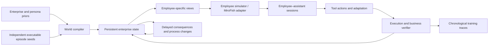

# Current implementation

The v0.3 extension adds reacting enterprises, an agency, consumers, and a real Hermes/bubblewrap computer per frontline employee. See [ECOSYSTEM_DESIGN.md](ECOSYSTEM_DESIGN.md) for the implemented state, authority and training contract. The original research discussion below includes historical fixture assumptions.

# Learning to keep work effective as the enterprise changes

Research proposal and executable PoC · 9 September 2026

**Implementation update:** the initial procedural reference fixture described in this proposal has been superseded as the PoC by a real [Persona 8B + MiroFish integration](../README.md). Six pinned dataset records become native OASIS employees, whose generated requests drive a separate LLM work agent. Employee notes, colleague communication, assistant skills and business effects persist across days. The original controlled reference experiments remain useful for engine tests; they are not results from the integrated model run. No RL training has yet been performed.

## 1. The research question

**Can an agent learn when and how to revise its way of working, using incomplete workplace evidence, so that it maintains long-term business value as people, procedures, tools, and goals change?**

The proposed training unit is an **enterprise lifespan**. A lifespan contains persistent people, shared business objects, multiple employee–agent relationships, and a causally connected stream of work over simulated weeks or months. A session is a temporary interaction boundary inside that lifespan. Ending a chat does not reset the enterprise, erase the assistant's learned state, settle all outstanding consequences, or restore old procedures.

The motivating progression from next-token prediction to lifelong agents is useful as a progression in the scope of feedback and interaction. It is not a strict hierarchy of model objectives: next-token prediction can train models on every one of these data types. The change we need is in the structure of experience and its supervision: from isolated demonstrations to persistent, intervenable worlds with feedback on future work.

We focus on adaptation to **previously useful knowledge becoming conditionally wrong**. Initial onboarding and remembering stable processes are controls. We do not need a new memory architecture to define this problem; external memory, executable skills, recurrent state, online adapters, and weight updates should all be eligible solutions.

The working name for the proposal is **Enterprise Lifespans**. This is a research direction and simulator prototype, not a validated benchmark or an established novel method.

## 2. Positioning against the linked and adjacent work

| Work | Relevant contribution | Implication for this project |
|---|---|---|
| [Terminal-Universe](https://arxiv.org/abs/2609.04148v1) | Reconstructs reusable terminal environments from trajectories, then expands tasks across workspaces and into multi-round sessions. | A source of executable task seeds and reconstruction techniques. Our extension would preserve state and causal consequences across separate sessions and organizational changes. |
| [ClawEnvKit](https://arxiv.org/pdf/2604.18543) | Generates task specifications, tool interfaces, and scoring configurations, with validation and execution-log-based evaluation. | Useful environment compilation machinery. We need an additional longitudinal transition model and outcomes tied to persistent business state. The unversioned PDF resolved to v4 during this review. |
| [MatrAIx / Persona 8B](https://arxiv.org/html/2608.04205v1) | Uses a dependency-aware persona schema and population generation. Its evaluation trials are explicitly independent and share no state. | Useful population priors. Employee records must additionally be conditioned on an organization's roles, authority, relationships, and workload, then coupled through shared events. The integrated PoCs import pinned synthetic records from the actual public Persona 8B coreset. |
| [MiroFish](https://github.com/666ghj/MiroFish) | Provides graph construction, persona generation, multi-agent simulation, and temporal memory infrastructure. The inspected local implementation uses Twitter/Reddit profiles and simulation platforms. | Candidate machinery for employee interactions and information propagation. A workplace tool backend and trusted business-state engine are additional components. The PoC does not assume the existing social simulation already implements them. |
| [δ-mem](https://github.com/declare-lab/delta-Mem) | Maintains a compact associative online state through delta-rule writes alongside a frozen backbone. | A candidate adaptation substrate to evaluate under the same lifespan distribution. Efficient online storage alone does not specify which procedure should govern a current business action. |
| [Meta-Harness](https://arxiv.org/abs/2603.28052) | Searches over harness code using previous candidates' code, scores, and execution traces. | An outer-loop optimizer that could optimize lifelong adaptation behavior. The cited identifier is Meta-Harness. We would change the evaluation contract from task scores to held-out lifespan returns and adaptation diagnostics. |
| [LifelongAgentBench](https://arxiv.org/abs/2505.11942) | Provides skill-grounded, interdependent tasks in database, operating-system, and knowledge-graph environments. | Interdependent task sequences already exist; sequence length alone is not our contribution. |
| [Arc CL-Bench](https://github.com/Arc-Computer/CL-Bench) | Evaluates agents on stateful CRM workflows, cross-entity relationships, mutations, and multi-turn tasks. | Enterprise state and real tool constraints are also established ingredients. We need evidence of what longitudinal change mechanisms add. |
| [LifeSide](https://arxiv.org/abs/2606.04660) and [RHELM](https://www.microsoft.com/en-us/research/publication/beyond-static-dialogues-benchmarking-realistic-heterogeneous-and-evolving-long-term-memory/) | LifeSide models persistent users and event trajectories; RHELM generates temporally evolving dialogues synchronized with external information. | Evolving personas and coherent multi-session histories are prior art. We target executable work and downstream utility under changes in collaboration. |
| [TraineeBench](https://aclanthology.org/2026.findings-acl.1505/) | Examines exploration, scheduling, and learning in dynamic workplace scenarios. | Workplace adaptation is already an explicit evaluation target. |
| [MORPHEUS, described by its authors](https://skyfall.ai/blog/llms-are-not-continual-learners) | Describes persistent enterprise operations, structured drift, delayed outcomes, and continual RL in resource allocation and scheduling. | The closest overlap with the broad proposal. “Persistent enterprise simulation for continual RL” would not be a defensible novelty claim. The linked OpenReview paper could not be opened because it required browser verification; this characterization uses the authors' description. |
| [MemRL](https://arxiv.org/abs/2601.03192) | Learns utility estimates for episodic-memory retrieval from environmental feedback with a frozen LLM. | Reward-trained memory selection is prior art too. The research target must extend to effective workplace behavior, including procedural changes and information gathering. |

This is a targeted source review, not an exhaustive novelty audit. We should read the full closest systems and compare their released implementations before making a paper-level novelty claim. We also should not equate frozen weights with an inability to adapt: context, recurrent state, retrieved procedures, and harness changes can alter future behavior. The evaluation must identify which persistent state is allowed to change.

The more specific potential contribution is the combination of:

1. **Coupled employee–agent lifespans:** employees change their beliefs, delegation, and working practices in response to outcomes; several pairs affect shared projects and artifacts.
2. **Controlled changes with unequal visibility:** the rule in force, employee beliefs, published evidence, and assistant memory can disagree for identifiable reasons.
3. **Executable, causally connected work:** doing the wrong thing has a state transition and a later cost, rather than just an incorrect answer label.
4. **Matched intervention tests:** change a process, an observation channel, or an adaptation action while preserving the relevant starting state and exogenous randomness.
5. **A training distribution over adaptation problems:** learn to investigate, revise, scope, retain, and reuse procedures according to their future utility.

Each component has precedents. The claim to investigate is whether this combination exposes failure modes and trains transferable capabilities that the closest existing environments do not.

## 3. A concrete lifespan

Consider a small software-services enterprise with customer onboarding, renewals, and incident operations. Each employee has a persistent assistant, but their assistants do not automatically share private observations or memory.

| Time | Enterprise event | What different people may know | Adaptation demanded |
|---|---|---|---|
| Week 1 | Normal renewal procedure uses the account lead's approval. | The handbook and recent successful work agree. | Establish stable task competence. |
| Week 3 | Regulated accounts require a risk review and a different approver. | Announced ahead of its effective date; some employees read it late. | Apply the new procedure at the right time and only to the relevant accounts. |
| Week 4 | Operations changes the onboarding interface. | Old instructions remain available; the documentation update is delayed. | Detect failure, seek evidence, and revise the tool-use procedure. Some initial failures are informationally unavoidable. |
| Week 6 | An incident war room temporarily replaces the usual coordination channel. | An announcement specifies an end date. | Adopt the exception, then restore the normal procedure without forgetting it. |
| Week 8 | A colleague repeats an obsolete approval shortcut. | The message is recent and plausible, but lacks authority to change policy. | Resist an incorrect update despite its recency. |
| Week 9 | Reorganization changes the default renewal approver. | The regulated-account exception still applies. | Revise the general rule without overwriting a valid specialized rule. |
| Later | Repeated failed work causes the operations team to introduce peer review. | The new practice depends on this agent's own past behavior. | Adapt to changes the agent helped cause. |

The same user request can now require different actions at different times. Conversely, a new announcement does not necessarily require changing every related skill. The relevant capability is selective revision with effective execution.

## 4. Formalization

### 4.1 World and interaction state

Let a generated enterprise specification be \(\omega\sim\mathcal D_\psi\), where \(\psi\) controls organization structure, workflow families, change mechanisms, observation channels, and workload distributions. Its lifespan uses a global event index \(t\), with elapsed simulated time \(\Delta_t\). Sessions are subsets of this sequence, not separate environments.

Define latent state

\[
s_t=(x_t,z_t,\{h_t^i\}_{i=1}^{N},q_t).
\]

- \(x_t\): business objects, tool records, projects, commitments, permissions, and workflow state.
- \(z_t\): the operative context—procedures, goals, preferences, authority, tool semantics, and their validity conditions.
- \(h_t^i\): employee \(i\)'s knowledge, intentions, workload, trust, and current work practices.
- \(q_t\): outstanding events and delayed consequences, including approvals, deliveries, deadlines, and information propagation.

Assistant \(i\) has persistent adaptive state \(\eta_t^i\), which may include beliefs, memory, skills, online weights, or harness state. It receives only

\[
o_t^i\sim O_\omega(s_t,i,\mathcal H_t^i),
\]

where \(\mathcal H_t^i\) is its authorized interaction history. A simulator knowing tomorrow's change must not disclose it today unless an actual announcement has already occurred.

The assistant selects both a work action and an adaptation action:

\[
(a_t^i,m_t^i)\sim\pi_\theta(o_t^i,\eta_t^i),\qquad
\eta_{t+1}^i=U_\phi(\eta_t^i,o_t^i,a_t^i,m_t^i,f_{t+1}^i).
\]

Here \(m\) can mean search, ask, test a procedure, invalidate a skill, install a scoped replacement, consolidate an update, or run an allowed online update. It need not be a separate textual output; an implementation can express these as tool calls or internal computation. \(f\) is feedback that has actually arrived, not the hidden grader's future knowledge.

Employees take their own actions \(b_t\). The world evolves as

\[
s_{t+1}\sim P_\omega(s_{t+1}\mid s_t,a_t,b_t,\epsilon_t),
\qquad
b_t\sim\mu_\omega(b_t\mid h_t,x_t,\text{received evidence}).
\]

This is naturally a partially observed multi-agent stochastic game. With employee policies and other assistants fixed, it becomes a POMDP for one learner. From the assistant's perspective the environment is nonstationary; augmenting the hidden state with the context regime can make the generative process Markov. “Nonstationary” should not imply we abandon a precise transition model.

### 4.2 Objective: effective work over time

For each event, record a utility vector: business outcome, delay, rework, human effort, operational violations, compute, and maintenance cost. Fix a scalarization before a run:

\[
r_t=v_t^{\mathrm{business}}-\lambda_d c_t^{\mathrm{delay}}
-\lambda_r c_t^{\mathrm{rework}}-\lambda_h c_t^{\mathrm{human}}
-\lambda_v c_t^{\mathrm{violation}}-\lambda_c c_t^{\mathrm{compute}}.
\]

Then learn

\[
\max_{\theta,\phi}\;\mathbb E_{\omega,\tau}
\left[\sum_{t=0}^{T}\Gamma_t r_t\right],
\qquad \Gamma_t=\exp\left(-\rho\sum_{j<t}\Delta_j\right),
\]

subject to declared access and resource constraints. Undiscounted finite-horizon utility is also valid; the PoC uses it. In a continuing benchmark, average reward per simulated workday is another useful objective. Use elapsed time rather than accidentally favoring a policy because its tool calls create more index steps.

Report the utility components alongside the scalar. A model should not score well merely by avoiding difficult work, repeatedly querying a user, accumulating easy completions, or satisfying a grader's preferred text. Score common incoming work and outstanding commitments, including work people stop delegating after failures.

### 4.3 What counts as adaptation?

Good performance after change is necessary but insufficient. A policy might solve every task from a fresh full-state dump. To establish adaptation, test whether persistent experience improves subsequent decisions or reduces their cost under matched observations and budgets.

Compare at least:

- The same agent with persistent state retained versus reset at session boundaries.
- Stable context versus changed context with the same initial competence.
- Immediate access to authoritative evidence versus delayed or noisy evidence.
- Correct scope-aware updating versus indiscriminate replacement.
- Agent state before and after adaptation on identical counterfactual probes.

Information has value only through improved future decisions. A useful research target is

\[
\operatorname{VOI}(m\mid b_t,g_t)=
\mathbb E[V(b_{t+1},g_{t+1})\mid m]-V(b_t,g_t)-c(m),
\]

where \(b_t\) is the assistant's belief over current conditions and \(g_t\) its commitments. This motivates learning when to consult a person or revalidate a skill, rather than asking on every task or preserving every past instruction.

### 4.4 Changes and evidence are different objects

A change operator should specify its preconditions, affected entities, causal parents, effective interval, scope, state mutation, and downstream effects. Its observation process separately specifies documents, tool behavior, human communications, delivery delays, and misleading evidence.

A single rule or learned procedure may need:

```
subject / predicate / value
scope: enterprise, department, employee, project, customer segment
source and authority
published_at / received_at
valid_from / valid_until
supersedes / exception_to / depends_on
supporting observations / confidence / observed utility
```

This is one useful baseline representation, not a required architecture for the learner. Preserve distinctions among permanent replacement, local exception, temporary override, reversal, rumor, and changed goals. Naive time decay cannot express all of them: old information may remain valid, and new information may be irrelevant or false.

## 5. Lifespan generation algorithm

The generator should compile a world, then roll it forward. LLMs propose semantic content and behaviors; executable mechanisms own state transitions and grading. This reduces the chance that a fluent narrator can make contradictory events or reward its own invented solution.

### Inputs and outputs

Inputs: enterprise archetypes; typed workflow seeds; optional persona priors; simulation horizon; drift and communication distributions; tool backends; resource limits; an evaluation split assignment.

Outputs: world specifications and generator provenance; separately stored hidden state and observable artifacts; replayable event logs; per-assistant sessions and persistent states; tool and business reward transitions; matched intervention probes; validation results and split manifests.

### Stage A — Compile the initial enterprise

1. Sample business model, organizational structure, departments, workflows, tools, and workload. Condition these jointly: authority must match roles, work must have owners, and projects must have resources and dependencies.
2. Sample employees conditional on their workplace roles. Use job expertise, communication, availability, checking habits, and collaboration preferences. A broad persona database supplies candidate priors, not evidence that the resulting workforce is realistic.
3. Instantiate business objects and executable workflow templates. Each template declares preconditions, actions, side effects, completion predicates, and delayed outcomes. Separate the request expressed by the employee from what must actually become true.
4. Construct initial documents, employee beliefs, and permissions by projection from the world. Include controlled gaps and disagreements instead of copying the full truth to every persona.

### Stage B — Lift independent episodes into reusable workflow seeds

Represent an imported episode as

\[
e=(\operatorname{Pre},\operatorname{Tools},\operatorname{Effects},\operatorname{Goal},\operatorname{Evidence}).
\]

Strip accidental entity names and bind its typed roles to the enterprise: a customer, owner, workspace, approval authority, and business object. Reconcile the episode's dependencies with the receiving world's current state. If the episode assumes an approved contract, either bind it to an existing approved contract or schedule work that creates one. Do not fabricate a postcondition merely to make the next transcript fit.

Use a dependency graph to link outputs to later inputs: onboarding can create a renewal opportunity; a release can create support load; a failed task can create rework. Reject incompatible seeds or insert explicit bridge tasks with verifiable effects. Historical logs can condition task proposals, but the next task is sampled from current world state and open commitments.

### Stage C — Generate a structured change process

Mix exogenous shocks and endogenous responses. A possible event intensity is

\[
\lambda_k(t)=\lambda_k^{\mathrm{base}}(\omega,t)
+f_k(\text{backlog},\text{incidents},\text{recent outcomes},\text{employee state}).
\]

This is a design family, not an estimated enterprise hazard model. Until calibrated, its parameters are experimental controls.

Cover abrupt and gradual drift, local and global changes, recurring regimes, temporary exceptions, and interacting changes. Change operating procedures, workflow topology, tool semantics, goal tradeoffs, social authority, and observation reliability. Keep a meaningful fraction of knowledge stable so indiscriminate forgetting is penalized.

For every change, compile a causal effect graph and a separate evidence schedule. A later memo should not make a previously unknowable change retrospectively “obvious.” Allow declared blackout intervals, but do not interpret performance during those intervals as a pure memory failure.

### Stage D — Roll out coupled work and interaction

```text
for enterprise specification omega in sample_worlds(split):
    world = compile_and_validate(omega)
    employee_states = initialize_partial_beliefs(world)
    assistant_states = initialize_assistants()
    while simulated_time < horizon:
        process_due_external_events_and_delayed_outcomes(world)
        propagate_evidence_to_authorized_recipients(world)
        update_employee_goals_practices_and_delegation(world)
        instantiate_work_from_open_commitments_and_new_demand(world)
        for scheduled employee-assistant interaction:
            observation = project_only_available_evidence(world, employee)
            repeat until session ends or budget is exhausted:
                action = assistant(observation, persistent_assistant_state)
                result = execute_validated_action(world, action)
                append_tool_result_and_arrived_feedback(result)
            retain_assistant_state_and_unfinished_work()
        propose_endogenous_changes_from_actual_outcomes(world)
        checkpoint_world_employees_and_assistants()
    export_separate_learner_and_evaluator_artifacts()
```

Different employees can work concurrently in the eventual system. Conflicting writes need an explicit ordering or transaction mechanism; changing scheduling order must not silently change experiment semantics. The PoC serializes sessions deterministically within a day.

### Stage E — Validate and select training experience

Use several independent checks:

- **Structural correctness:** entity references, authority, ownership, resources, workflow preconditions, temporal consistency, and event causality.
- **Executability:** a reference policy can realize the intended goal where sufficient evidence and budget exist. Verify state effects, not tool-call mentions.
- **Information integrity:** future changes and hidden graders never appear in learner or employee prompts. Reject impossible tasks unless they belong to an explicit abstention or diagnosis category.
- **Adaptation necessity:** on matched probes, a formerly useful procedure fails after change, a corrected one works, and irrelevant changes do not require rewriting it.
- **Behavioral validity:** independently review whether employee communications and reactions are plausible. Internal consistency is not evidence of human realism.
- **Diversity and shortcuts:** hold out workflow and change compositions, vary surface language separately from mechanisms, and audit whether template identifiers reveal the solution.

Keep failed and delayed trajectories when they carry valid learning signals. Filtering only for successful sessions would remove precisely the experience needed to learn detection and recovery. Generator selection by agent weakness should run on training worlds; freeze test generators and configurations before comparing candidate methods.

## 6. Learning beyond memory storage

### A candidate adaptation controller

Maintain beliefs about current operating conditions and the scope of each procedure. On new evidence or an unexpected outcome:

1. Identify which assumptions or procedure steps the evidence challenges.
2. Estimate whether more information is worth its work, delay, and human cost.
3. Gather evidence through the same authorized tools available during normal work.
4. Construct a scoped procedure revision or alternate workflow, preserving unaffected knowledge.
5. Test or use the revision, observe downstream results, and update its estimated utility.
6. Consolidate reusable changes while retaining enough provenance to reverse temporary ones.

This is an algorithm sketch. Bayesian filtering, change-point methods, memory graphs, skill programs, online adapters, or learned recurrent policies are all implementation choices. The research question is whether learning the controller improves cumulative work outcomes under held-out change mechanisms.

### Three separable training experiments

**Behavior learning:** train tool-use and adaptation actions with RL over lifespans. Reward the resulting business outcomes and charge for information gathering. A successful update receives credit when it improves later work, not simply when the agent writes a plausible memory entry.

**Adaptation-substrate learning:** compare external memory, skills, δ-mem-style online states, and parameter updates with matched observation and compute budgets. Keep the outer training objective and world splits fixed. A change in weights is not inherently better than a correct procedural update.

**Harness learning:** use a Meta-Harness-like outer loop to search retrieval, testing, update, and consolidation code. Evaluate proposals on multiple training enterprises and select on separate validation enterprises. Lock the selected harness before test lifespans begin.

Use supervised trajectories for basic tool competence, then train adaptation behavior. Otherwise a failure to call the tool can masquerade as a failure to adapt. Keep baseline warm-up performance matched and report it separately.

### Long-horizon credit assignment

Keep session boundaries distinct from environment termination. Delayed business rewards must reach actions and update decisions made in earlier sessions. A recurrent rollout can span several sessions, with truncated backpropagation and checkpointed adaptive state; a memory method can use the same chronological transitions without differentiating through all history.

For a controller that writes a procedure \(m\), a useful auxiliary comparison is the return difference between forks that retain and suppress that write under a shared future exogenous event tape. This is a counterfactual training signal, not automatically an unbiased policy gradient. Future employee responses and workload must be resimulated in each fork because they depend on the action. Do not replay the same fixed future transcript after different actions and call it a causal effect.

Dense rewards may speed training, but retain business utility as the principal evaluation and ablate shaping. Exact procedure IDs, hidden regime labels, and optimal-action templates are evaluator data. If used for training an auxiliary predictor, label the setting as privileged supervision and keep test-time access unchanged.

## 7. Evaluation contract

### Core metrics

| Metric | Definition and purpose |
|---|---|
| Longitudinal utility | Settled business value minus all declared costs over a common horizon; also report its components. |
| Common incoming-work completion | Completion of the same exogenous jobs, including unfinished and withheld jobs in the denominator. |
| Initial-plan validity | Whether the first attempted plan works before tool-error-driven correction; separates prevention from recovery. |
| Evidence-relative adaptation lag | Number of relevant opportunities after usable evidence becomes available until a predeclared sustained-success threshold is reached. Report censored cases and calendar time separately. |
| Recovery cost | Failed attempts, rework, delay, queries, and human effort between change and recovery. |
| Unaffected-skill retention | Performance on matched probes whose correct procedure did not change. |
| Scope-transfer errors | Misapplying a local change to unaffected users, accounts, or departments. |
| Recurring-regime reuse | Cost and speed when an old valid procedure becomes relevant again. |
| Appropriate resistance to updates | Error rate under misleading or irrelevant new evidence. |
| Human collaboration burden | Questions, corrections, interruptions, withheld delegation, and calibrated employee effort. |

Measure a paired difference from a reference policy on the same generated enterprise, but do not casually call it dynamic regret. Different actions induce different future states. A valid counterfactual return comparison starts at the same state, shares exogenous randomness, and resimulates endogenous transitions. A clairvoyant oracle is a diagnostic upper bound with more information, not a fair learner baseline; also include a reference constrained to the learner's observation budget.

The PoC implements utility, incoming-work completion, initial-plan validity, queries, abandonment, backlog, trust, and outcome-dependent follow-ups. It does **not** yet implement the full adaptation-lag, retention, or transfer evaluation suite. Existing logs provide inputs for those additions, but a measure should not be claimed until its probe construction and denominator are implemented.

### Baselines and controls

Use a frozen procedure library; a stateless agent with fresh retrieval; append-only retrieval; recency decay; a scoped temporal store; a skill-updating agent; an online-state method; an online weight-update method; and full-context access where feasible. Give methods equal tools, per-session observations, update permissions, and explicit budget accounting. The implemented reference controllers are much simpler mechanism checks and must not stand in for these literature baselines.

Run static-world, no-memory, immediate-evidence, no-employee-response, no-endogenous-change, shuffled-history, and fixed-future-transcript ablations. Shuffling is an intentionally invalid causal control, not an alternative data-generation method. It tests whether actual temporal structure matters.

### Splits and statistics

Split by enterprise family and causal template before generating rollouts. Multiple branches, employees, and sessions from one enterprise stay together. Randomly splitting JSONL session rows would leak its procedures and future events.

Hold out change compositions, organization topology, workflow families, tool semantics, and employee behavior policies. Within a test lifespan, chronological learning from observations and feedback is allowed; tuning an algorithm across completed test lifespans is not. Reset learned deployment state between independent test enterprises unless transfer across enterprises is the explicitly declared evaluation.

Use paired world seeds and independent named random streams for demand, shocks, employee behavior, and model sampling. Estimate uncertainty across enterprises or independent lifespans, not thousands of correlated sessions. A suitable first experiment might use 10 or more seeds per condition and cluster bootstrap intervals; select the eventual sample size from a pilot variance and power analysis. The current three-enterprise demonstration supports no generalization or statistical significance claim.

## 8. MiroFish integration and realism

Keep the world engine authoritative for work objects, procedure validity, permissions, transitions, and rewards. Use MiroFish to propose employee messages, local decisions, social propagation, and reactions from each employee's permitted view. Validate proposed actions against the world contract before applying them.



The adapter contract is specified in `INTEGRATION.md`. The v0.2 implementation now calls the completed MiroFish installation and imports real Persona 8B records. It uses native projects, graphs, OASIS profiles, simulation and interviews. Employee state is explicitly persisted by the adapter because native interviews do not retain it by default. The MiroFish source and existing setup configuration were not changed.

Start with a small, inspectable organization. Thousands of personas do not fix an invalid causal model. Increase workforce size only when coordination and information propagation are demonstrated bottlenecks. Calibrate employee delay, correction, delegation, and process-change mechanisms using consented longitudinal workflow evidence or expert-authored scenarios. Test held-out human behavior and independently implemented simulators; do not accept fluency or persona adherence as proof of real-world transfer.

## 9. Reference-fixture boundary and decisive next experiment

The implemented system generates three enterprise instances, each with six active employees across three workflow departments. Defaults span 84 simulated calendar days. It supports scoped review changes, tool migration and rollback, changed disclosure procedures, temporary channels, misleading messages, and a reorganization. Failed actions can reduce trust, withhold later delegation, and cause a new review practice. Successful onboarding generates follow-up work; unfinished work persists and can become late or abandoned.

That v0.1 reference fixture used typed tools and five hand-written controllers with templated employee language. The v0.2 integrated PoC replaces those employee and assistant controllers with real MiroFish/OASIS inference, imported Persona 8B profiles and native LLM function calls. Authority IDs remain abstract queues, not fully simulated managers. Tasks do not yet involve complex workflow search, project planning, resource negotiation, or content-level document verification. All enterprise instances share a structural template. RL optimization, a δ-mem implementation, and controlled generalization experiments have not been performed.

The strongest next experiment is **matched observation, different persistent adaptation state** on held-out procedure changes:

1. Use the implemented LLM tool agent and MiroFish employee adapter; keep the executable engine fixed for comparisons.
2. Add genuine workflow-topology changes, such as a new prerequisite or a changed cross-team handoff, so solving the task involves more than choosing fields from documents.
3. Compare persistent learned procedures, full retrieval, and online adaptive state under matched cost budgets.
4. Train adaptation decisions on one set of lifespans, then evaluate on held-out organizations and change compositions.
5. Test whether retained learning improves business utility and recovery efficiency without harming unaffected work.

The desired result is not “memory helps.” It is evidence that a learned adaptation policy can recognize when its process has become wrong, acquire the missing evidence efficiently, revise only the affected behavior, and preserve useful competence as the workplace continues to evolve.
